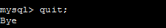

# Analyzing the infrastructure of the monolithic application

## Task 2.1: Verify that the monolithic application is available


## Task 2.2: Test the monolithic web application

### Choose List of suppliers.


### Add a new supplier.


### Edit an entry.


## Task 2.3: Analyze how the monolithic application runs

### 1. Use EC2 Instance Connect to connect to the MonolithicAppServer instance.


### 2. Analyze how the application is running.

``` bash
sudo lsof -i :80

ubuntu@ip-10-16-10-150:~$ sudo lsof -i:80
COMMAND PID USER   FD   TYPE DEVICE SIZE/OFF NODE NAME
node    441 root   18u  IPv6  21556      0t0  TCP *:http (LISTEN)
```


#### What did you notice in the command output? What port and protocol is the node daemon using?

```
It runs the in port 80 the protocol TCP

```

Run the following command:  

``` bash
ps -ef | head -1; ps -ef | grep node

UID          PID    PPID  C STIME TTY          TIME CMD
root         423     421  0 14:13 ?        00:00:00 sudo node index.js
root         441     423  0 14:13 ?        00:00:01 node index.js
ubuntu      2501    2400  0 15:05 pts/0    00:00:00 grep --color=auto node
```

#### What did you notice in the command output? Which user on this EC2 instance is running a node process? Does the node process ID (PID) match any of the PIDs from the output of the command that you ran before the last one?

```
The user in  root,  yes one of the PID process that match is the PID 441

```

### 3.  To analyze the application structure, run the following commands:

``` bash
cd ~/resources/codebase_partner

ls -l

drwxr-xr-x  5 ubuntu root  4096 Jul 17 21:11 app
-rw-------  1 ubuntu root  1554 Apr  1 23:39 index.js
drwxr-xr-x 72 root   root  4096 Jul 17 21:11 node_modules
-rw-------  1 ubuntu root 22681 Apr  1 23:39 package-lock.json
-rw-------  1 ubuntu root   461 Apr  1 23:39 package.json
drwxr-xr-x  5 ubuntu root  4096 Jul 17 21:11 public
drwxr-xr-x  2 ubuntu root  4096 Jul 17 21:11 views
```

index.js file:  


``` js
const express = require("express");
const bodyParser = require("body-parser");
const cors = require("cors")
const supplier = require("./app/controller/supplier.controller");
const app = express();
const mustacheExpress = require("mustache-express")
const favicon = require('serve-favicon');

// parse requests of content-type: application/json
app.use(bodyParser.json());
// parse requests of content-type: application/x-www-form-urlencoded
app.use(bodyParser.urlencoded({extended: true}));
app.use(cors());
app.options("*", cors());
app.engine("html", mustacheExpress())
app.set("view engine", "html")
app.set("views", __dirname + "/views")
app.use(express.static('public'));
app.use(favicon(__dirname + "/public/img/favicon.ico"));

// list all the suppliers
app.get("/", (req, res) => {
    res.render("home", {});
});
app.get("/suppliers/", supplier.findAll);
// show the add suppler form
app.get("/supplier-add", (req, res) => {
    res.render("supplier-add", {});
});
// receive the add supplier POST
app.post("/supplier-add", supplier.create);
// show the update form
app.get("/supplier-update/:id", supplier.findOne);
// receive the update POST
app.post("/supplier-update", supplier.update);
// receive the POST to delete a supplier
app.post("/supplier-remove/:id", supplier.remove);
// handle 404
app.use(function (req, res, next) {
    res.status(404).render("404", {});
})


// set port, listen for requests
const app_port = process.env.APP_PORT || 80
app.listen(app_port, () => {
    console.log(`Server is running on port ${app_port}.`);
});

```

### 4. Connect a MySQL client to the RDS database that the node application stores data in

Find and copy the endpoint of the RDS database that is running in the lab environment.


To verify that the database can be reached from the MonolithicAppServer instance on the standard MySQL port number, use the nmap -Pn command with the RDS database endpoint that you copied.

```bash 
$ nmap -Pn supplierdb.ckki0tgrbxv0.us-east-1.rds.amazonaws.com
Starting Nmap 7.80 ( https://nmap.org ) at 2024-08-04 15:46 UTC
Nmap scan report for supplierdb.ckki0tgrbxv0.us-east-1.rds.amazonaws.com (10.16.30.126)
Host is up (0.00051s latency).
rDNS record for 10.16.30.126: ip-10-16-30-126.ec2.internal
Not shown: 999 filtered ports
PORT     STATE SERVICE
3306/tcp open  mysql

Nmap done: 1 IP address (1 host up) scanned in 6.57 seconds
```

To connect to the database, use the MySQL client that is already installed on the MonolithicAppServer instance. Use the following values:

    Username: admin

    Password: lab-password


```
To connect to the database, use the MySQL client that is already installed on the MonolithicAppServer instance. Use the following values:

username: admin
Password: lab-password
```

```

$ mysql -h supplierdb.ckki0tgrbxv0.us-east-1.rds.amazonaws.com -P 3306 -u admin -p
Enter password: 
Welcome to the MySQL monitor.  Commands end with ; or \g.
Your MySQL connection id is 4920
Server version: 8.0.35 Source distribution

Copyright (c) 2000, 2024, Oracle and/or its affiliates.

Oracle is a registered trademark of Oracle Corporation and/or its
affiliates. Other names may be trademarks of their respective
owners.

Type 'help;' or '\h' for help. Type '\c' to clear the current input statement.

mysql> 
```


### 5.  Observe the data in the database.
From the mysql> prompt, run SQL commands as appropriate to see that a database named COFFEE contains a table named suppliers.

This table contains the supplier entry or entries that you added earlier when you tested the web application.


Exit the MySQL client and then close the EC2 Instance Connect tab. Also close the coffee suppliers web application tab.

