# Phase 3: Creating a development environment and checking code into a Git repository

## Task 3.1: Create an AWS Cloud9 IDE as your work environment

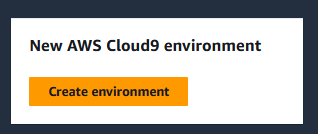

### Create an AWS Cloud9 instance that is named MicroservicesIDE and then open the IDE.

It should run as a new EC2 instance of size t3.small and run Amazon Linux 2. The instance should support SSH connections and run in the LabVPC in Public Subnet1.

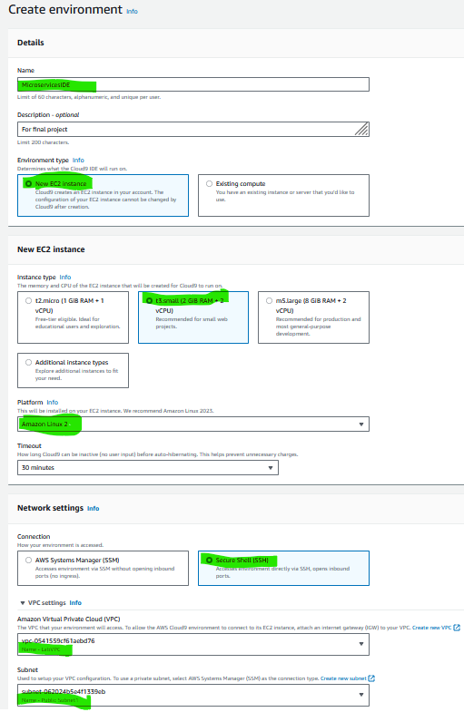

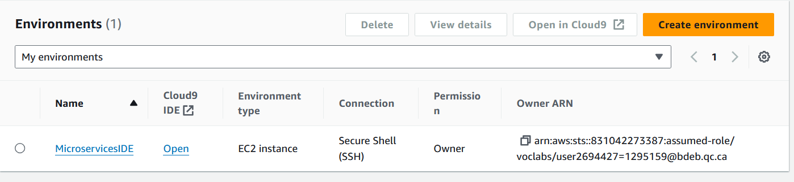


## Task 3.2: Copy the application code to your IDE

### 1.  From the AWS Details panel on this lab instructions page, download the labsuser.pem file to your local computer.

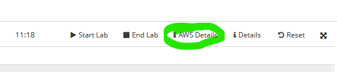
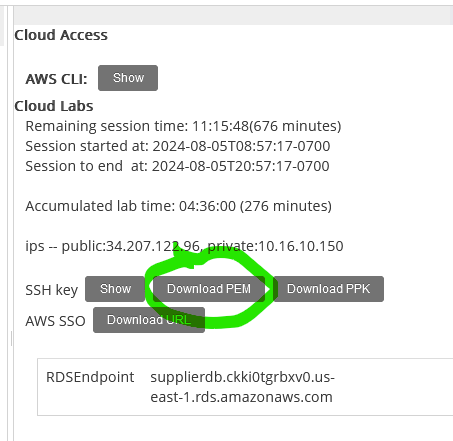

### 2.  Upload the .pem file to your AWS Cloud9 IDE, and use the Linux chmod command to set the proper permissions on the file so that you can use it to connect to an EC2 instance.

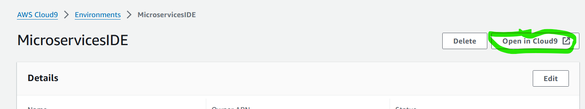
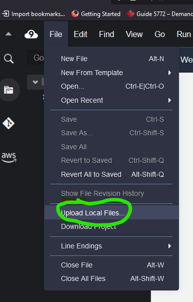
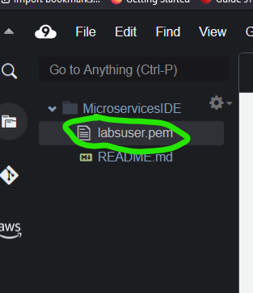
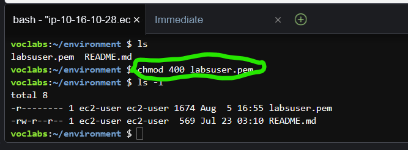


### 3.  Create a temp directory on the AWS Cloud9 instance at /home/ec2-user/environment/temp

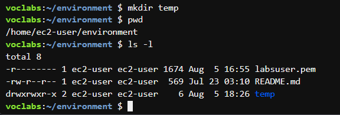

### 4.  From the Amazon EC2 console, retrieve the private IPv4 address of the MonolithicAppServer instance.

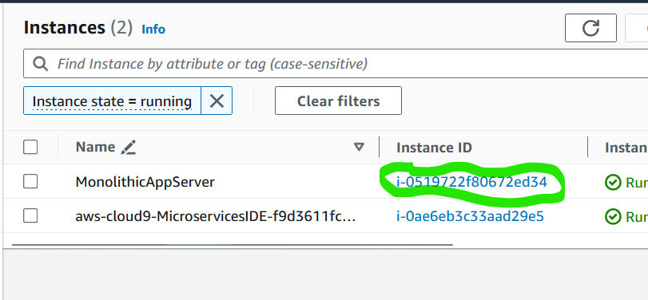
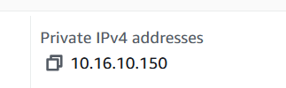

### 5.  Use the Linux scp command in the Bash terminal on the AWS Cloud9 instance to copy the source code for the node application from the MonolithicAppServer instance to the temp directory that you created on the AWS Cloud9 instance.

The following snippet provides an example scp command:

``` bash
scp -r -i ~/environment/labsuser.pem ubuntu@10.16.10.150:/home/ubuntu/resources/codebase_partner/* ~/environment/temp/
```

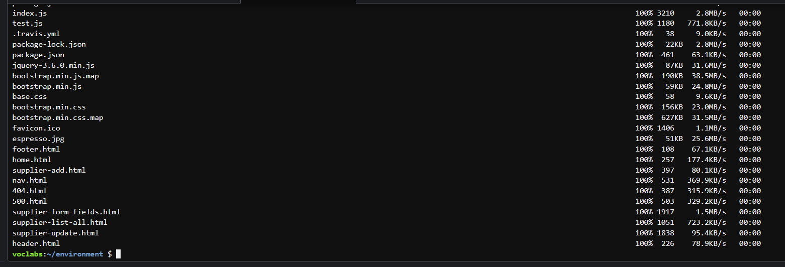

### 6. In the file browser of the IDE, verify that the source files for the application have been copied to the temp directory on the AWS Cloud9 instance.

Copied files:  

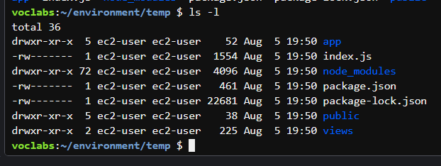


## Task 3.3: Create working directories with starter code for the two microservices

### 1.  In the microservices directory, create two new directories that are named customer and employee.

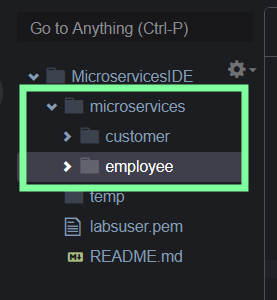

### 2.  Place a copy of the source code for the monolithic application in each new directory, and remove the files from the temp directory.

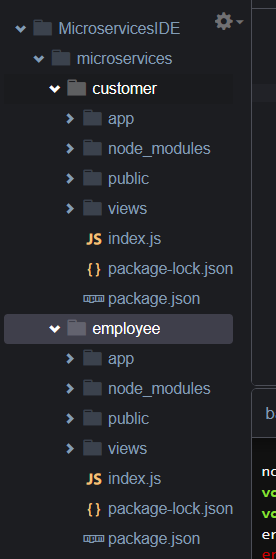


### 3.  Delete the empty temp directory.

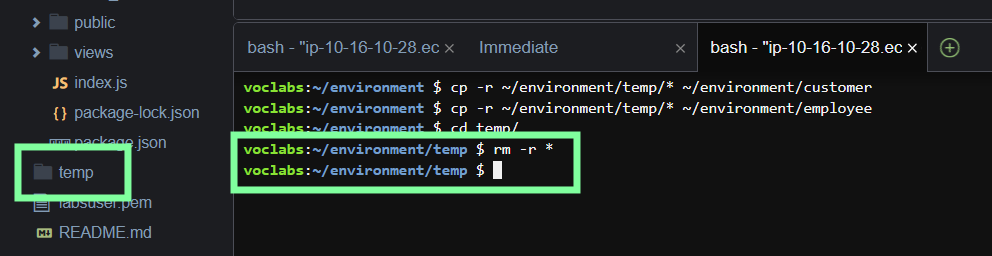

## Task 3.4: Create a Git repository for the microservices code and push the code to CodeCommit

### 1.  Create a CodeCommit repository that is named microservices.

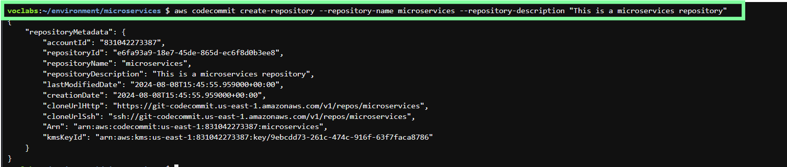

### 2.  To check the unmodified application code into the microservices CodeCommit repository, run the following commands:

``` bash
cd ~/environment/microservices

git init

git branch -m dev 

git add .

git commit -m 'two unmodified copies of the application code'

git remote add origin https://git-codecommit.us-east-1.amazonaws.com/v1/repos/microservices

git push -u origin dev

```

### 3. Configure your Git client to know your username and email address.

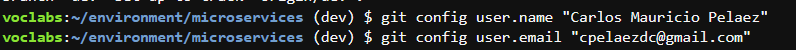

### 4.  In a new browser tab, browse to the CodeCommit console and observe that the code is now checked into your microservices repository.

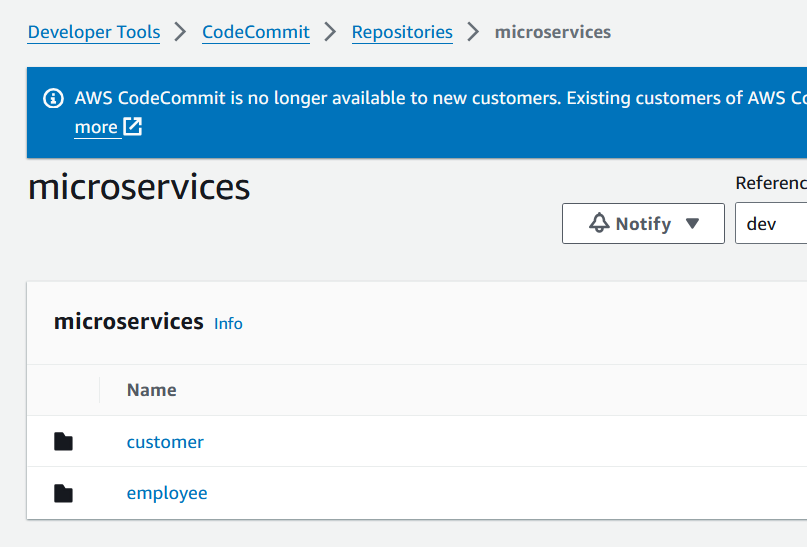