# Phase 4: Configuring the application as two microservices and testing them in Docker containers


## Task 4.1: Adjust the AWS Cloud9 instance security group settings

### 1.  Adjust the security group of the AWS Cloud9 EC2 instance to allow inbound network traffic on TCP ports 8080 and 8081.

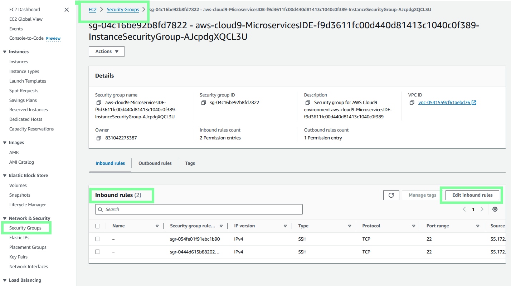

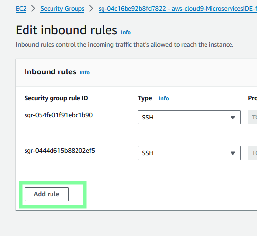

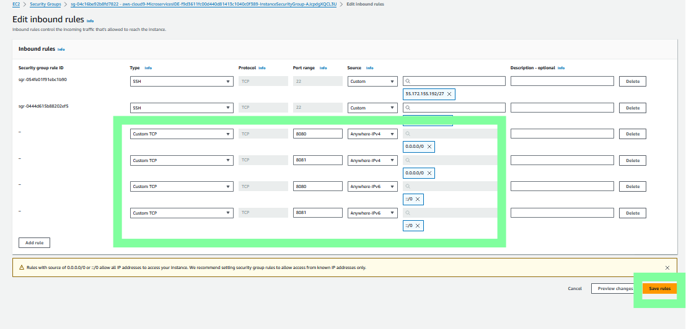

## Task 4.2: Modify the source code of the customer microservice

### 1.  In the AWS Cloud9 file panel, collapse the employee directory, if it is expanded, and then expand the customer directory.

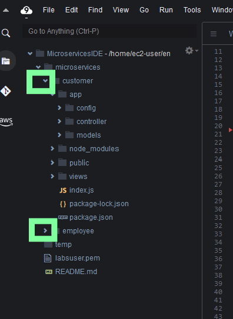

### 2. Edit the customer/app/controller/supplier.controller.js file so that the remaining functions provide only the read-only actions that you want customers to be able to perform.

 Tip: After you edit the file, it should contain only the following lines:

```
 const Supplier = require("../models/supplier.model.js");

 const {body, validationResult} = require("express-validator");


 exports.findAll = (req, res) => {

     Supplier.getAll((err, data) => {

         if (err)

             res.render("500", {message: "The was a problem retrieving the list of suppliers"});

         else res.render("supplier-list-all", {suppliers: data});

     });

 };


 exports.findOne = (req, res) => {

     Supplier.findById(req.params.id, (err, data) => {

         if (err) {

             if (err.kind === "not_found") {

                 res.status(404).send({

                     message: `Not found Supplier with id ${req.params.id}.`

                 });

             } else {

                 res.render("500", {message: `Error retrieving Supplier with id ${req.params.id}`});

             }

         } else res.render("supplier-update", {supplier: data});

     });

 };
```

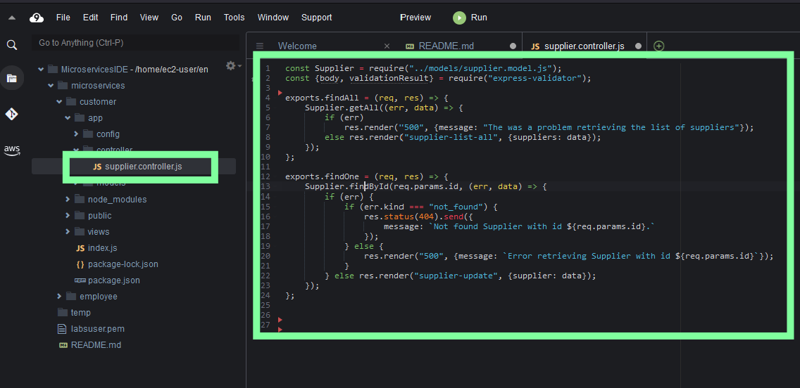


### 3.  Edit the customer/app/models/supplier.model.js file. Delete the unnecessary functions in it so that what remains are only read-only functions.

 Important: KEEP the last line of the file: module.exports = Supplier;

 Note: The model should still contain two functions: Supplier.getAll and Supplier.findById.

 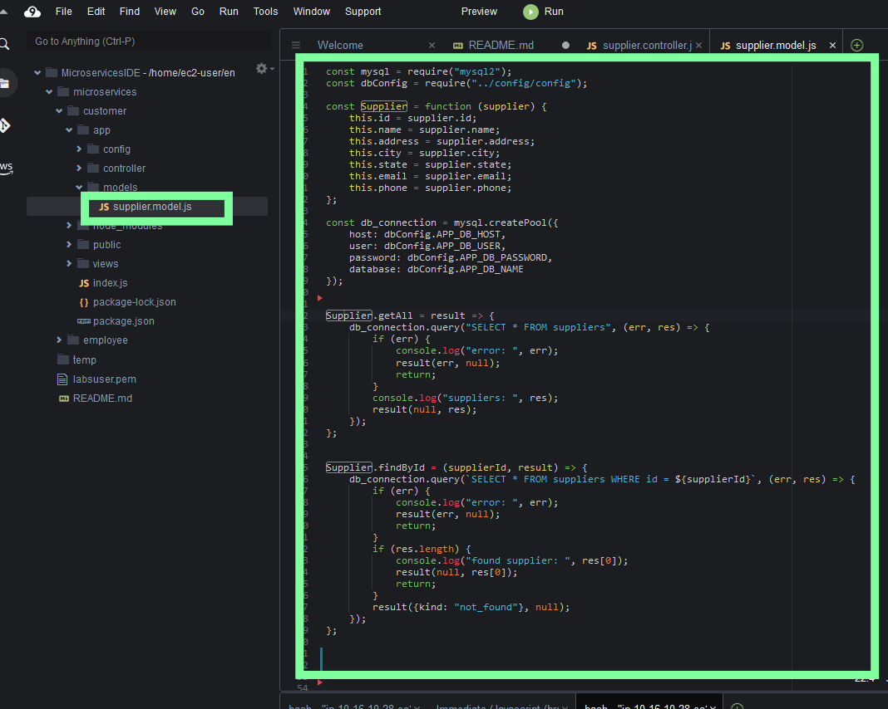

### 4.  Later in the project, when you deploy the microservices behind an Application Load Balancer, you will want employees to be able to navigate from the main customer page to the area of the web application where they can add, edit, or delete supplier entries. To support this, edit the customer/views/nav.html file:

    On line 3, change Monolithic Coffee suppliers to Coffee suppliers

    On line 7, change Home to Customer home

    Add a new line after line 8 that contains the following HTML:

     Important: DON'T delete or overwrite any of the existing lines in the file.

    <a class="nav-link" href="/admin/suppliers">Administrator link</a>

    Analysis: Adding this link will provide a navigation path to those pages that will be hosted under the /admin/ URL path.

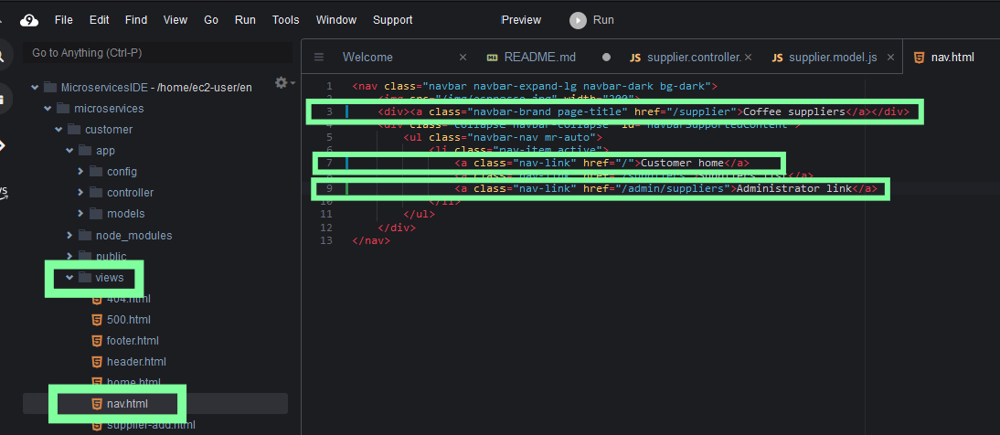

### 5. You don't want customers to see the Add a new supplier button or any edit buttons next to supplier rows. To implement these changes, edit the customer/views/supplier-list-all.html file:

    Remove line 32, which contains Add a new supplier.  

    Remove lines 26 and 27, which contain badge badge-info and supplier-update.     


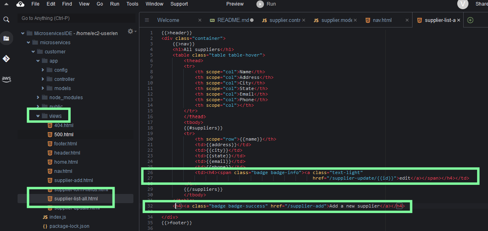

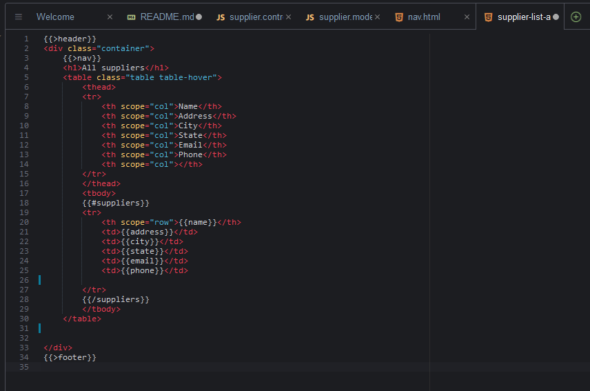

### 6.  Because the customer microservice doesn't need to support read-write actions, DELETE the following .html files from the customer/views directory:

    supplier-add.html

    supplier-form-fields.html

    supplier-update.html

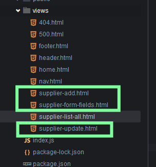

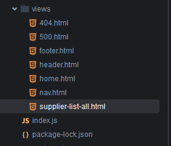


### 7.  Edit the customer/index.js file as needed to account for the fact that the node application will now run on Docker containers:

    Comment out lines 27 to 37 (ensure that each line starts with //).

    On line 45, change the port number to 8080

     Tip: Recall that when this application ran on the MonolithicAppServer instance, it ran on port 80. However, when it runs as a Docker container, you will want the container to run on port 8080.


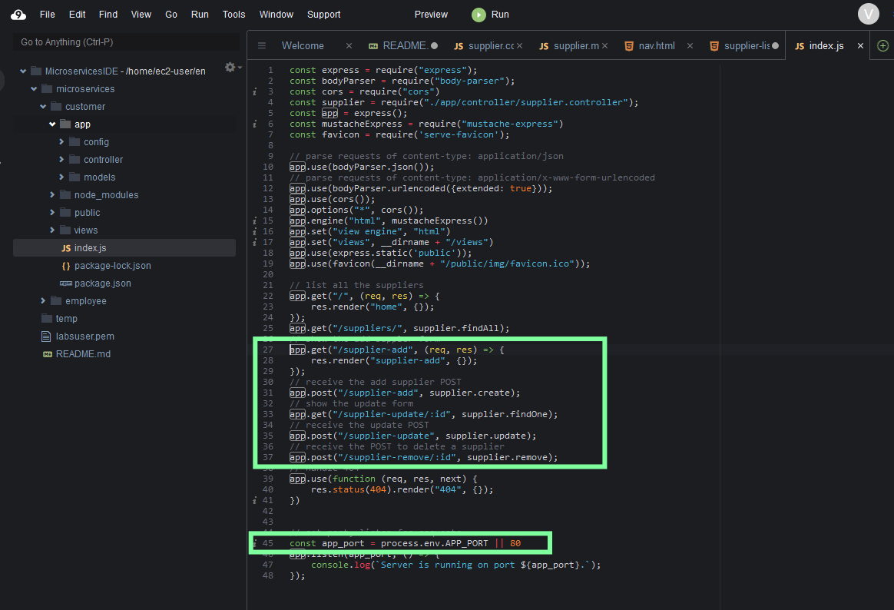

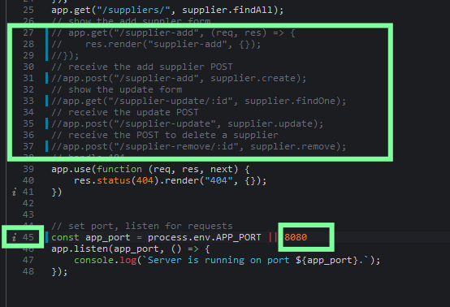


## Task 4.3: Create the customer microservice Dockerfile and launch a test container

### 1.  In the customer directory, create a new file named Dockerfile that contains the following code:

```yaml
FROM node:11-alpine

RUN mkdir -p /usr/src/app

WORKDIR /usr/src/app

COPY . .

RUN npm install

EXPOSE 8080

CMD ["npm", "run", "start"]
```

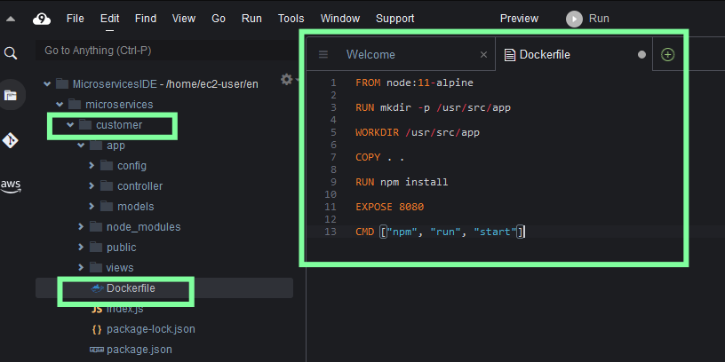

Analysis: This Dockerfile code specifies that an Alpine Linux distribution with Node.js runtime requirements should be used to create a Docker image. The code also specifies that the container should allow network traffic on TCP port 8080 and that the application should be run and started when a container that was created from the image is launched.


### 2.  Build an image from the customer Dockerfile.

    In the AWS Cloud9 terminal, change to the customer directory.

    Run the following command:

    docker build --tag customer .

     Note: In the output, ignore the npm warning about no repository field.

    Notice that the build downloaded the node Alpine starter image and then completed the other instructions as specified in the Dockerfile.

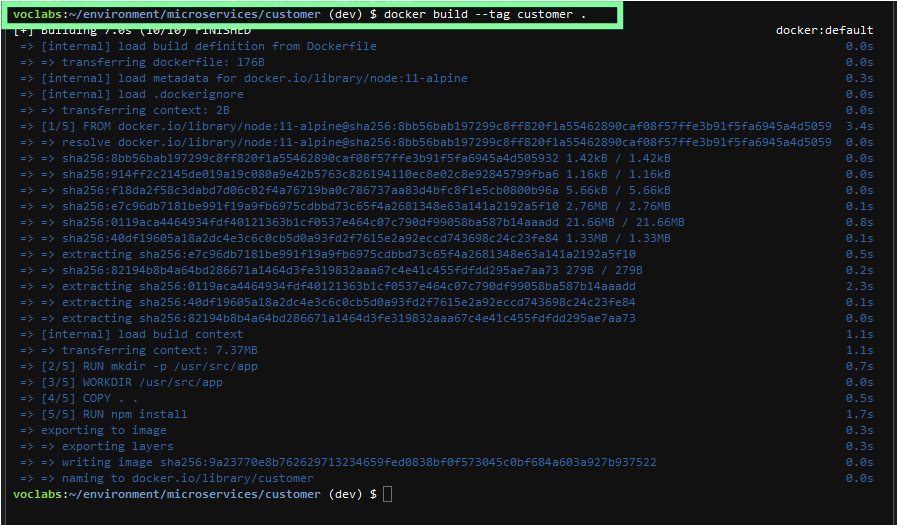

 Note: In the output, ignore the npm warning about no repository field.

Notice that the build downloaded the node Alpine starter image and then completed the other instructions as specified in the Dockerfile.


### 3.  Verify that the customer-labeled Docker image was created.

    Run a Docker command to list the Docker images that your Docker client is aware of.

     Tip: To find the command that you need to run, see Use the Docker Command Line in the Docker documentation.

     Tip: The output of the command should be similar to the following:

    REPOSITORY     TAG         IMAGE ID       CREATED          SIZE

    customer       latest      cdc593c9bf51   59 seconds ago   82.7MB

    node           11-alpine   f18da2f58c3d   3 years ago      75.5MB

     Note: The node image is the Alpine Linux image that you identified in the Dockerfile contents to download and use as the starter image. Your Docker client downloaded it from docker.io. The customer image is the one that you created.


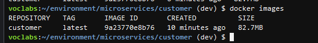


### 4.  Launch a Docker container that runs the customer microservice on port 8080. As part of the command, pass an environment variable to tell the node application the correct location of the database.

To set a dbEndpoint variable in your terminal session, run the following commands:

``` bash 
dbEndpoint=$(cat ~/environment/microservices/customer/app/config/config.js | grep 'APP_DB_HOST' | cut -d '"' -f2)

echo $dbEndpoint
```

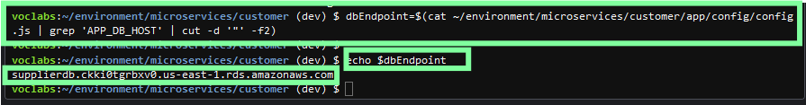


The following code provides an example of the command you should run that launches a container from the image:

```bash
docker run -d --name customer_1 -p 8080:8080 -e APP_DB_HOST="$dbEndpoint" customer
```

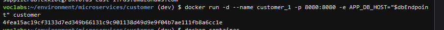

Analysis: This command launched a container named customer_1 by using the customer image that you created as the template. The -d parameter in the command specified that it should run in the background. After the -p parameter, the first number specified the port on the AWS Cloud9 instance to publish the container to. The second number indicated the port that the container is running on in the docker namespace (also port 8080). The -e parameter passes the database host location as an environment variable to Docker, which gives the node application the information that it needs to establish network connectivity to the database.

### 5.  Check which Docker containers are currently running on the AWS Cloud9 instance.

 Tip: To find the command that you need to run, see Use the Docker Command Line in the Docker documentation.

 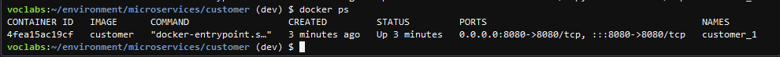

 ### 6.  Verify that the customer microservice is running in the container and working as intended.

Load the following page in a new browser tab. Replace the IP address placeholder with the public IPv4 address of the AWS Cloud9 instance that you are using: 

 Important: If you stop the lab environment and start it again, the public IPv4 address of the AWS Cloud9 instance will change.
```
http://<cloud-9-public-IPv4-address>:8080
```
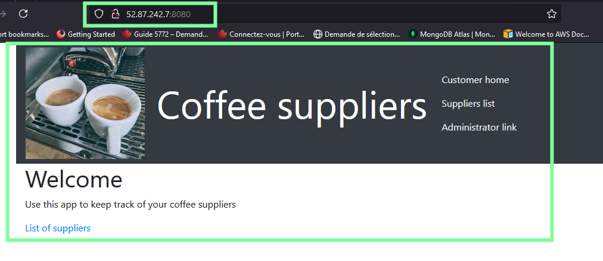


    The web application microservice should load in the browser.

     Important: If you stop the lab environment and start it again, the public IPv4 address of the AWS Cloud9 instance will change.

    Choose List of suppliers.

    Confirm that the supplier entries that you added earlier are displayed.

     Note: Although you changed the location where the application runs, it still connects to the same RDS database where the supplier records are stored.

     Tip: The Administrator link doesn't work because you haven't created the employee microservice yet.

    Confirm that the suppliers page doesn't have Add a new supplier and edit buttons.

     Troubleshooting tip: If any functionality is missing, follow these steps: (1) Stop and delete the running container, (2) modify the microservice source code as appropriate, (3) create an updated Docker image from the source code, (4) launch a new test container, and (5) verify whether the functionality is now available. For a list of commands to run to accomplish these steps, see Updating a test container running on Cloud9 in the appendix of this file.

### 7.  Commit and push your source code changes into CodeCommit.

 Tip: You can use the Git source control panel in the AWS Cloud9 IDE, or you can use the git commit and git push commands in the terminal.

 Note: If your educator has asked you to collect information about your solution, be sure to record the commands that you run in this step and the output that was returned.


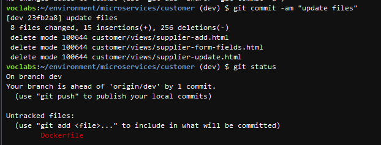

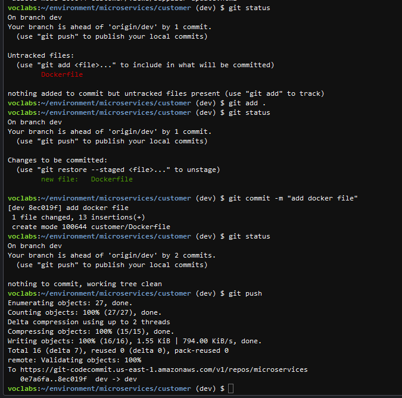

### 8.  Optional: Observe the commit details in the CodeCommit console.

In the Commits area of the repository, choose the ID for the most recent commit. Scroll down to see information about what changed in the files since the previous commit.

Notice that deleted lines are shown in red, and added lines are shown in green so that you are able to see every detail of every change to every file that was modified.


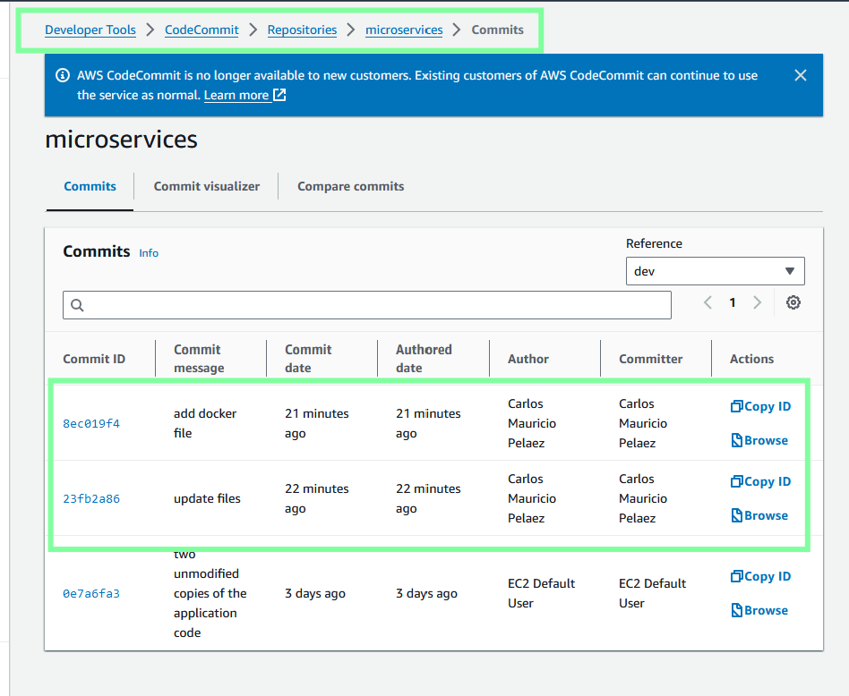


## Task 4.4: Modify the source code of the employee microservice

In this task, you will modify the source code for the employee microservice similarly to how you modified the code for the customer microservice. Customers (café franchise location managers) should have read-only access to the application data, but employees of the café corporate office should be able to add new entries or modify existing entries in the list of coffee suppliers.

As you will see later in this project, you will deploy the microservices behind an Application Load Balancer and route traffic to the microservices based on the path that is contained in the URL of the request. In this way, if the URL path includes /admin/, the load balancer will route the traffic to the employee microservice. Otherwise, if the URL path doesn't include /admin/, then the load balancer will route the traffic to the customer microservice.

Because of the need to route traffic, much of the work in this task is to configure the employee microservice to add /admin/ to the path of the pages that it serves.

### 1.  In the AWS Cloud9 IDE, return to the file view (toggletree view).

### 2. Collapse the customer directory, and then expand the employee directory.

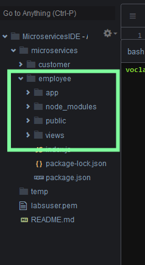

### 3. In the employee/app/controller/supplier.controller.js file, for all the redirect calls, prepend /admin to the path.

 Tip: To find the three lines that need to be updated, run the following commands in the terminal:

``` bash
cd ~/environment/microservices/employee

grep -n 'redirect' app/controller/supplier.controller.

```

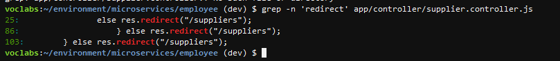
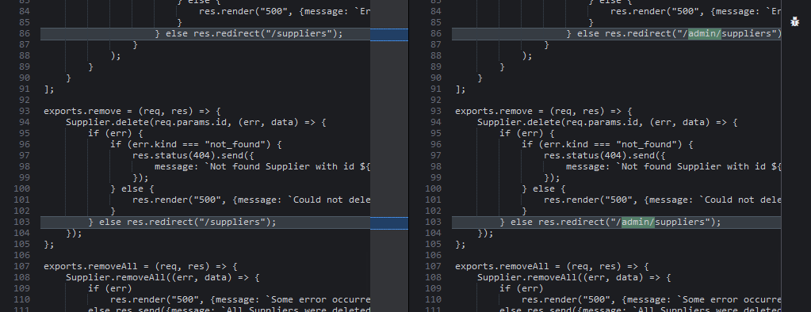


### 4.      In the employee/index.js file, update the app.get calls, app.post calls, and a port number.

        For all app.get and app.post calls, prepend /admin to the first parameter.

         Tip: To find the seven lines that need to be updated, run the following command in the terminal:

```bash
grep -n 'app.get\|app.post' index.js
```

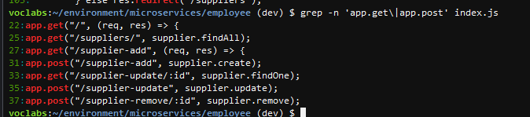

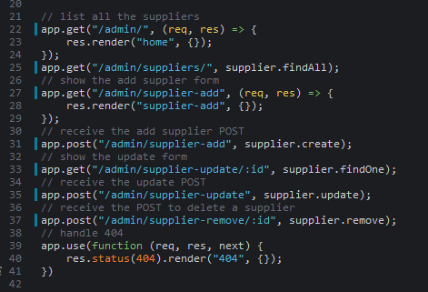

         Important: After you edit line 22, the path should be /admin, not /admin/

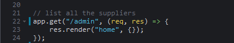

        On line 45, change the port number to 8081

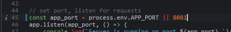

         Note: When you run both the customer and employee microservice containers on the AWS Cloud9 instance as a test, they will need to use different port numbers so that they won't conflict with each other.


### 5.  In the employee/views/supplier-add.html and employee/views/supplier-update.html files, for the form action paths, prepend /admin to the path.

 Tip: To find the three lines that need to be updated in the two files, run the following command in the terminal:

```bash
grep -n 'action' views/*
```

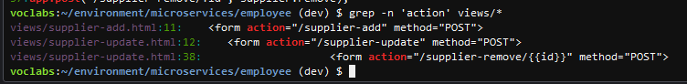

after update:

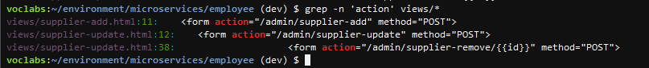


### 6.  In the employee/views/supplier-list-all.html and employee/views/home.html files, for the HTML paths, prepend /admin to the path.

 Tip: To find the three lines that need to be updated in the two files, run the following command in the terminal:

```bash
grep -n 'href' views/supplier-list-all.html views/home.html
```
After update:

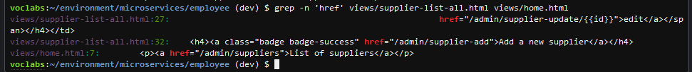

### 7.  In the employee/views/header.html file, modify the title to be Manage coffee suppliers

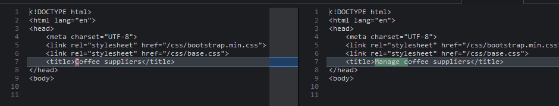

### 8.  Edit the employee/views/nav.html file

    On line 3, change Monolithic Coffee suppliers to Manage coffee suppliers

    On line 7, replace the existing line of code with the following:

    <a class="nav-link" href="/admin/suppliers">Administrator home</a>

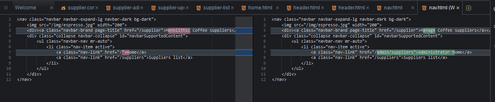

    Note: Both the href value and the name of the link are modified in the new line.

    Add a new line after line 8 that contains the following HTML:

     Important: DON'T delete or overwrite any of the existing lines in the file.

    ```
    <a class="nav-link" href="/">Customer home</a>
    ```

    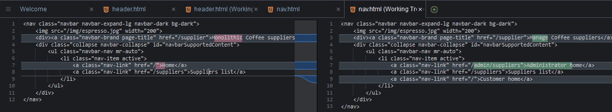


    Analysis: Later in the project, when you deploy the microservices behind an Application Load Balancer, you will want employees to be able to navigate from the admin pages back to the customer area of the web application. Adding this link provides a navigation path for employees to the pages that will be hosted by the customer microservice under the / URL path.

    Save the changes.

## Task 4.5: Create the employee microservice Dockerfile and launch a test container

In this task, you will create a Docker image for the employee microservice. Then, you will launch a test container from the image and verify that the microservice works as expected.

###  1. Create a Dockerfile for the employee microservice.

        Duplicate the Dockerfile from the customer microservice into the employee microservice area.

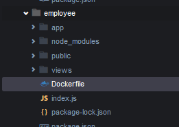

        Edit the employee/Dockerfile to change the port number on the EXPOSE line to 8081

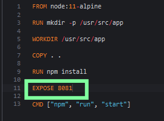
         

### 2.  Build the Docker image for the employee microservice. Specify employee as the tag.

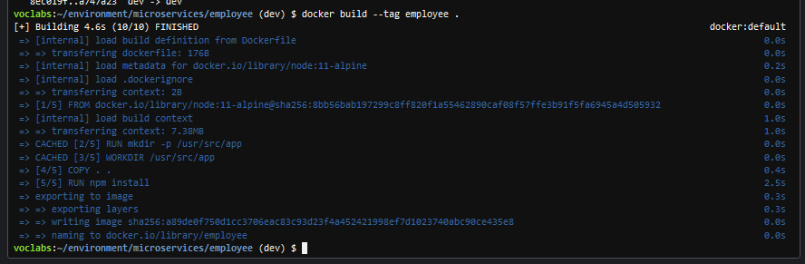

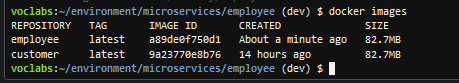

### 3.  Run a container named employee_1 based on the employee image. Run it on port 8081 and be sure to pass in the database endpoint.

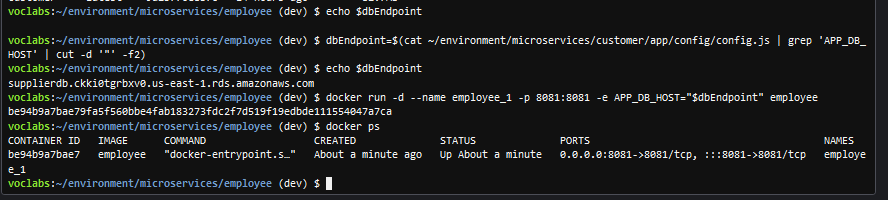

### 4.  Verify that the employee microservice is running in the container and that the microservice functions as intended.

Load the microservice web page in a new browser tab at 

```
http://<cloud9-public-ip-address>:8081/admin/
suppliers
```
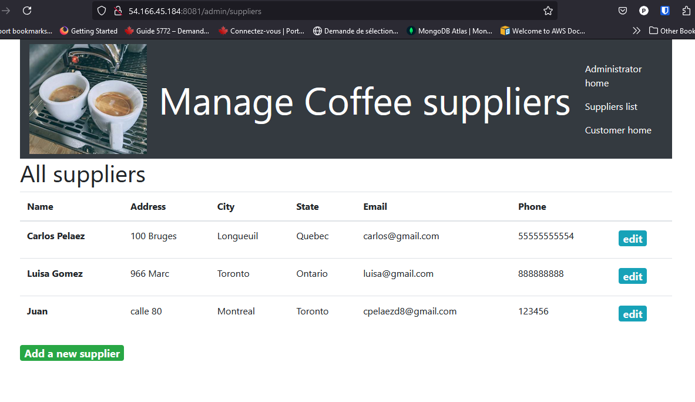

Verify that this view shows buttons to edit existing suppliers and to add a new supplier.

    Note: Links that should take you to the customer microservice will not work. For example, if you choose Customer home or Suppliers list, the pages won't be found because the link assumes that the customer microservice also runs on port 8081 (but it doesn't). You can ignore this issue—these links should work as intended when you deploy the microservices to Amazon ECS later.

        Test adding a new supplier.

        Verify that the new supplier appears on the suppliers page.

        Test editing an existing supplier.

        Verify that the edited supplier information appears on the suppliers page.

        Test deleting an existing supplier:

            On the row for a particular supplier entry, choose edit.

            At the bottom of the page, choose Delete this supplier, and then choose Delete this supplier again.

            Verify that the supplier no longer appears on the suppliers page.

             Troubleshooting tip: If any of the functionality  mentioned above isn't working as intended, follow these steps: (1) Stop and delete the running container, (2) modify the microservice source code as appropriate, (3) create an updated Docker image from the source code, (4) launch a new test container, and (5) verify whether the functionality is now available. For a list of commands to run to accomplish these steps, see Updating a test container running on Cloud9 in the appendix of this file.

### 5.  To observe details about both running test containers, run the following command:

    docker ps

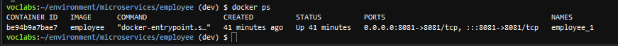

     
##  Task 4.6: Adjust the employee microservice port and rebuild the image

When you tested the employee microservice on the AWS Cloud9 instance, you ran it on port 8081. However, when you deploy it to Amazon ECS, you will want it to run on port 8080. To adjust this, you need to modify two files.

 

### 1.  Edit the employee/index.js and employee/Dockerfile files to change the port from 8081 to 8080

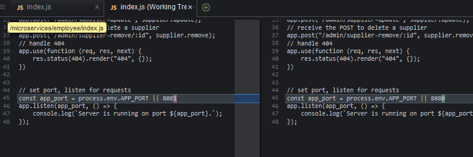
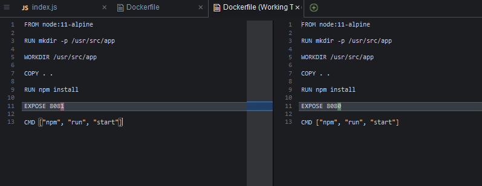

### 2.  Rebuild the Docker image for the employee microservice.

    To stop and delete the existing container (assumes that the container name is employee_), run the following command:

``` bash
docker rm -f employee_1 
```

    Ensure that your terminal is in the employee directory.

    Use the docker build command to build a new image from the latest source files that you edited. Use the employee tag.

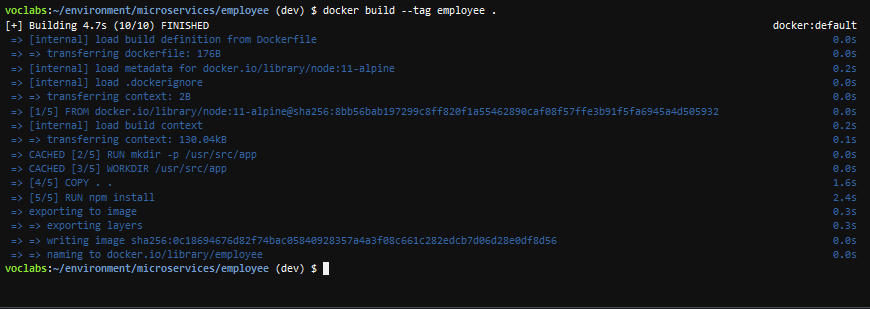

     Tip: If you build an image with the name of an existing image, the existing image will be overwritten.

     Note: You don't need to run a new test container, so you don't need to run docker run.

## Task 4.7: Check code into CodeCommit

In this task, you will commit and push the changes that you made to the employee microservice to CodeCommit.

### 1.  Review the updates that you made to the source code. To accomplish this:

        Choose the source control icon in the AWS Cloud9 IDE.

        Notice the changes list, which indicates which files were changed since you last checked files in to the remote Git repository (CodeCommit).

        Choose one of the files that was modified, such as index.js, to compare the version from the last Git commit to the latest version. Changes are highlighted.

        This demonstrates a benefit of using a source control system and a Git-compatible IDE such as AWS Cloud9. You can review your code changes prior to committing.

### 2.  Check your changes into CodeCommit.

     Tip: You performed this same type of action in task 4.3. You can accomplish this step by using the Git source control panel, or you can use the git commit and git push commands in the terminal.

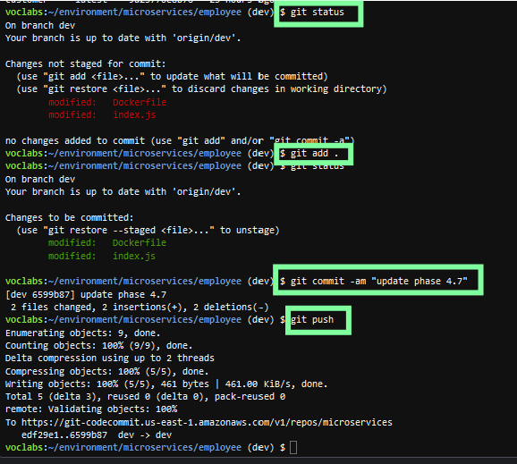