# Phase 5: Creating ECR repositories, an ECS cluster, task definitions, and AppSpec files

At this point, you have successfully implemented numerous solution requirements. You split the monolithic application into two microservices that can run as Docker containers. You have also verified that the containers support the needed application actions, such as adding, editing, and deleting entries from the database. The microservices architecture still uses Amazon RDS to store the coffee supplier entries.

However, your work isn't finished. There are more solution requirements to implement. The containers are able to run on the AWS Cloud9 instance, but that isn't a scalable deployment architecture. You need the ability to scale the number of containers that run on each microservice up and down depending on need. Also, you need to have a load balancer to route traffic to the appropriate microservice. Finally, you need to be able to easily update each application microservice's codebase independently and roll those changes into production. In the remaining phases of the project, you will work to accomplish these solution requirements.

## Task 5.1: Create ECR repositories and upload the Docker images

In this phase, you will upload the latest Docker images of the two microservices to separate Amazon ECR repositories.

 

### 1.  To authorize your Docker client to connect to the Amazon ECR service, run the following commands:

```bash    
account_id=$(aws sts get-caller-identity |grep Account|cut -d '"' -f4)

echo $account_id
aws ecr get-login-password --region us-east-1 | docker login --username AWS --password-stdin $account_id.dkr.ecr.us-east-1.amazonaws.com
```

    A message in the command output indicates that the login succeeded.


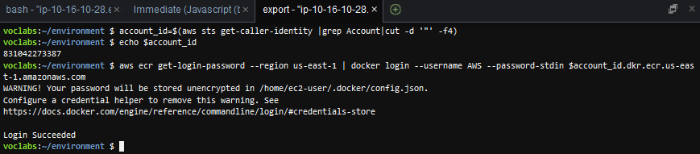

### 2.  Create a separate private ECR repository for each microservice.

Name the first repository customer

```bash
aws ecr create-repository --repository-name customer --image-scanning-configuration scanOnPush=true --region us-east-1
```

Name the second repository employee

```bash
aws ecr create-repository --repository-name employee --image-scanning-configuration scanOnPush=true --region us-east-1
```
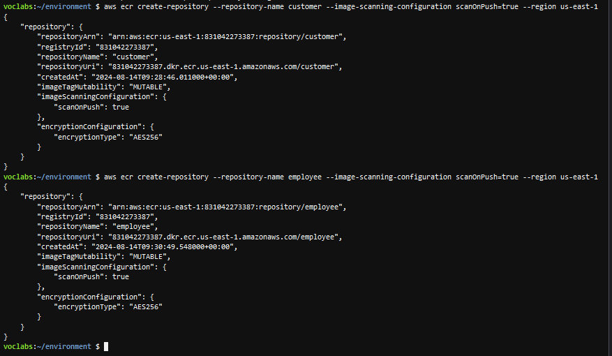

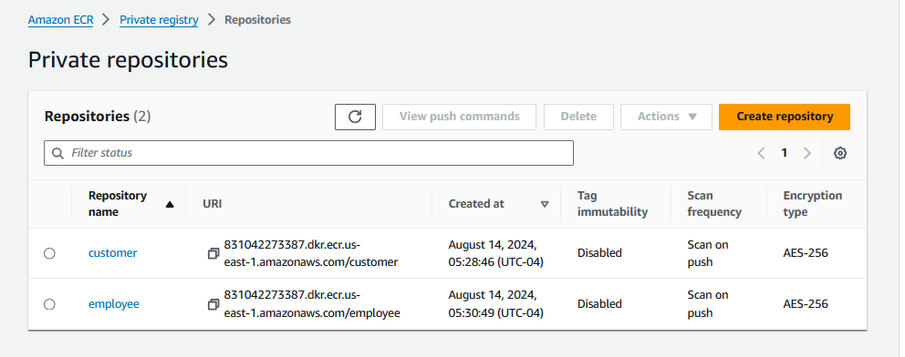

### 3.  Set permissions on the customer ECR repository.

For information about editing the existing JSON policy, see Setting a Private Repository Statement in the Amazon ECR User Guide.

Replace the existing lines in the policy with the following:

```json
{
    "Version": "2008-10-17",
    "Statement": [
    {
        "Effect": "Allow",
        "Principal": "*",
        "Action": "ecr:*"
    }
    ]
}
```

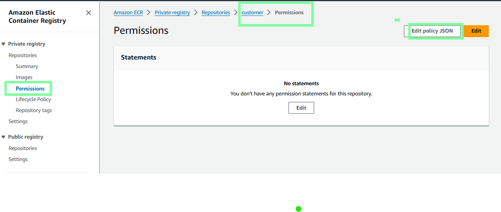

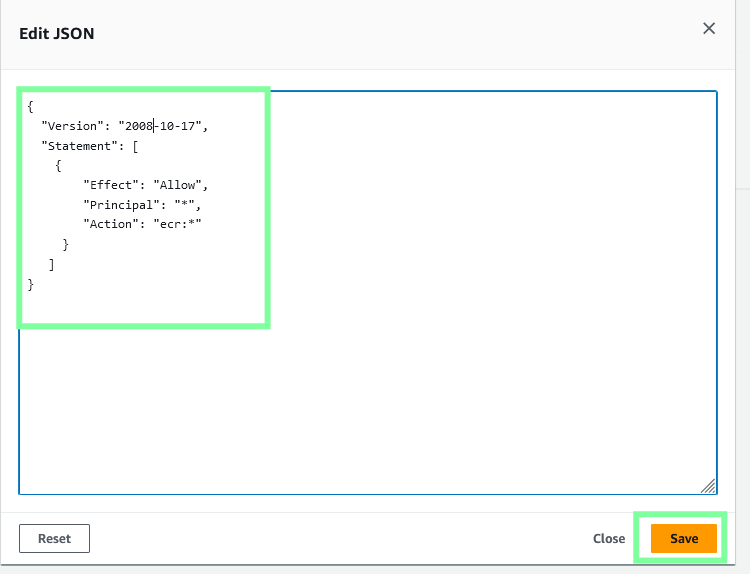

### 4.  Use the same approach to set the same permissions on the employee ECR repository.

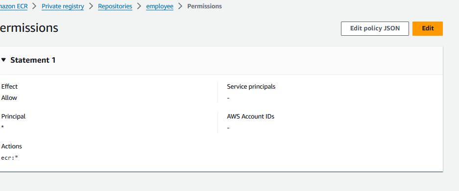

### 5.  Tag the Docker images with your unique registryId (account ID) value to make it easier to manage and keep track of these images.

In the AWS Cloud9 IDE, run the following commands:

```bash
account_id=$(aws sts get-caller-identity |grep Account|cut -d '"' -f4)

# Verify that the account_id value is assigned to the $account_id variable
echo $account_id

# Tag the customer image
docker tag customer:latest $account_id.dkr.ecr.us-east-1.amazonaws.com/customer:latest

# Tag the employee image
docker tag employee:latest $account_id.dkr.ecr.us-east-1.amazonaws.com/employee:latest
```

Note: The commands don't return output.

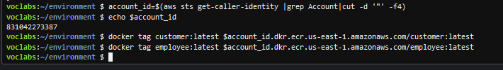

Run the appropriate docker command to verify that the images exist and the tags were applied.
     
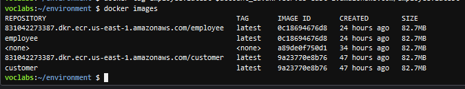

### 6.  Run the appropriate docker command to push each of the Docker images to Amazon ECR.

 Tip: To find the command that you need to run, see Use the Docker Command Line in the Docker documentation.

 Tip: Before running the Docker commands, run the following command to set account_id as a variable in the terminal. Then, when you run the Docker commands, you can reference the account ID as $account_id. 

```bash
account_id=$(aws sts get-caller-identity |grep Account|cut -d '"' -f4)
```
```bash
docker push $account_id.dkr.ecr.us-east-1.amazonaws.com/customer:latest

docker push $account_id.dkr.ecr.us-east-1.amazonaws.com/employee:latest
```
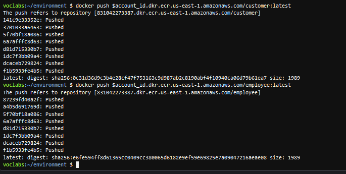

### 7.  Confirm that the two images are now stored in Amazon ECR and that each has the latest label applied.
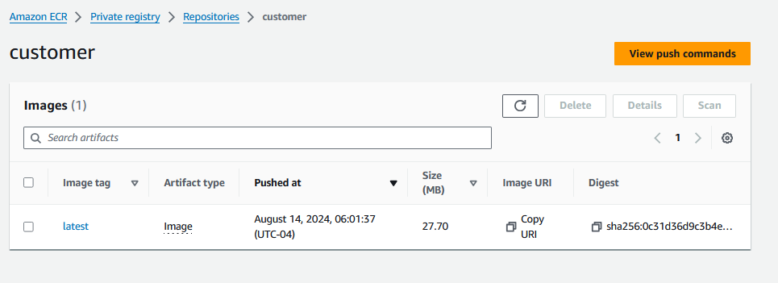
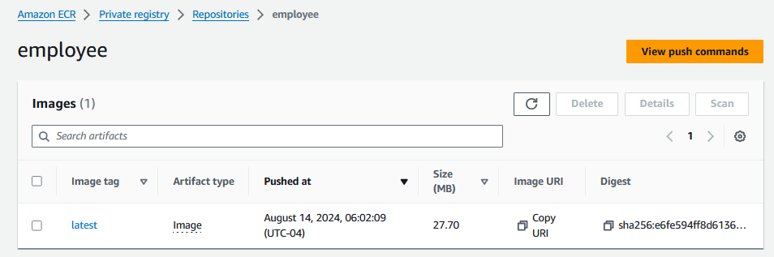

## Task 5.2: Create an ECS cluster

In this task, you will create an Amazon ECS cluster.


### 1.  Create a serverless AWS Fargate cluster that is named microservices-serverlesscluster

Ensure that it's configured to use LabVPC, PublicSubnet1, and PublicSubnet2 (remove any other subnets). DON'T select Amazon EC2 instances or ECS Anywhere.

Important: After choosing the button to create the cluster, in the banner that appears across the top of the page, choose View in CloudFormation. Wait until the stack that creates the cluster attains the status CREATE_COMPLETE before you proceed to the next task. If the stack fails to create for any reason and therefore rolls back, repeat these steps to try again. It should succeed the second time.

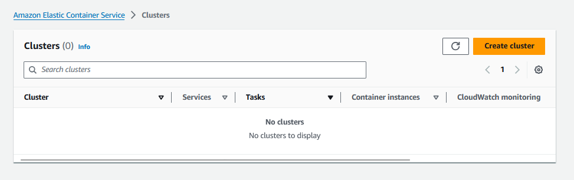

I added a -c to the name because the name suggested by the project exists. 

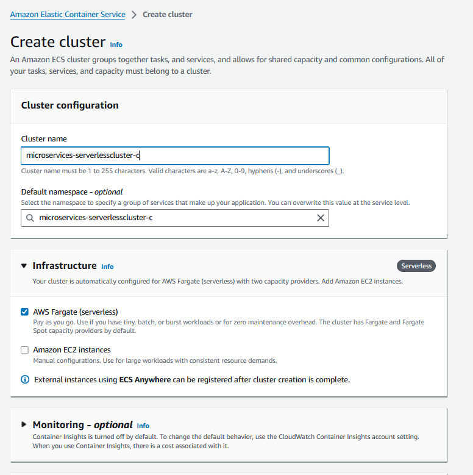
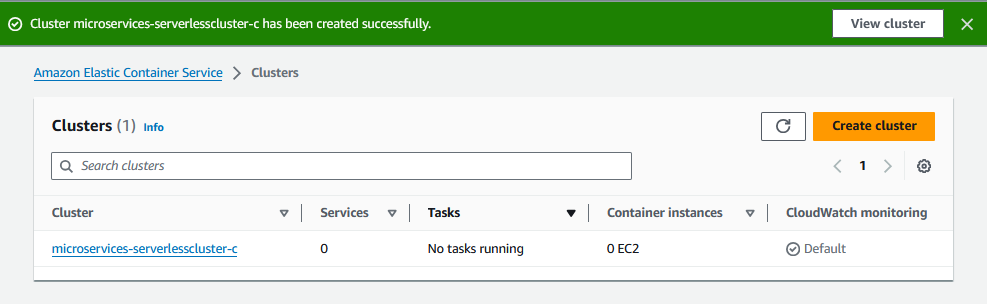


## Task 5.3: Create a CodeCommit repository to store deployment files

In this task, you will create another CodeCommit repository. This repository will store the task configuration specification files that Amazon ECS will use for each microservice. The repository will also store AppSpec specification files that CodeDeploy will use for each microservice.
 
### 1.  Create a new CodeCommit repository that is named deployment to store deployment configuration files.

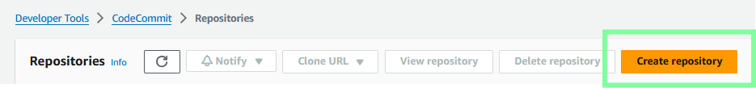
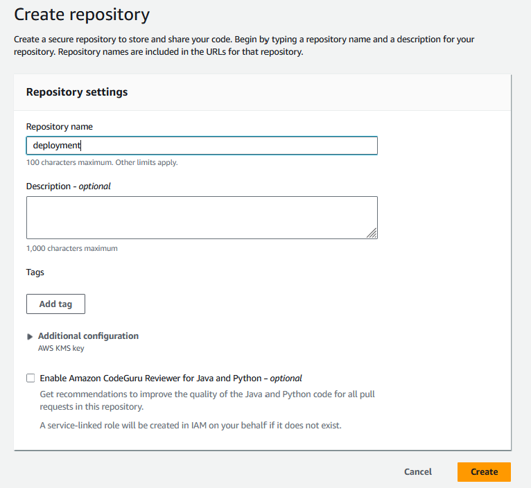

### 2.  In AWS Cloud9, in the environment directory, create a new directory that is named deployment. Initialize the directory as a Git repository with a branch named dev.


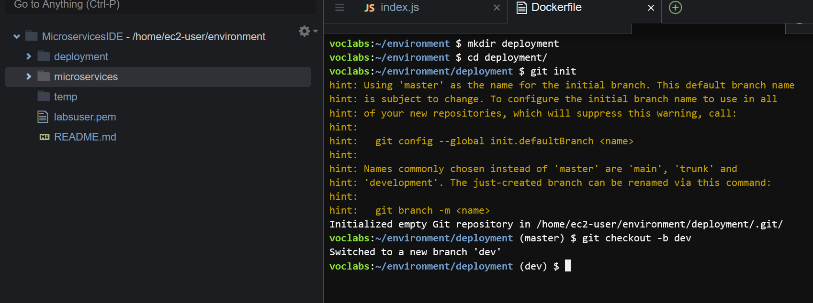


## Task 5.4: Create task definition files for each microservice and register them with Amazon ECS

In this task, you will create a task definition file for each microservice and then register the task definitions with Amazon ECS.

### 1.  In the new deployment directory, create an empty file named taskdef-customer.json 

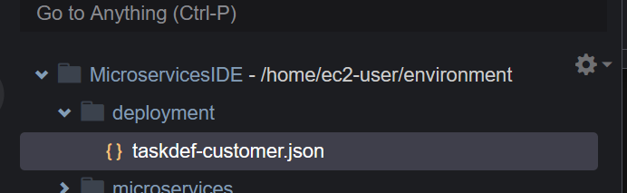


### 2.  Edit the taskdef-customer.json file.

        Paste the following JSON code into the file:

```json
{

    "containerDefinitions": [

        {

            "name": "customer",

            "image": "customer",

            "environment": [

                {

                    "name": "APP_DB_HOST",

                    "value": "<RDS-ENDPOINT>"

                }

            ],

            "essential": true,

            "portMappings": [

                {

                    "hostPort": 8080,

                    "protocol": "tcp",

                    "containerPort": 8080

                }

            ],

            "logConfiguration": {

                "logDriver": "awslogs",

                "options": {

                    "awslogs-create-group": "true",

                    "awslogs-group": "awslogs-capstone",

                    "awslogs-region": "us-east-1",

                    "awslogs-stream-prefix": "awslogs-capstone"

                }

            }

        }

    ],

    "requiresCompatibilities": [

        "FARGATE"

    ],

    "networkMode": "awsvpc",

    "cpu": "512",

    "memory": "1024",

    "executionRoleArn": "arn:aws:iam::<ACCOUNT-ID>:role/PipelineRole",

    "family": "customer-microservice"

}


```

Replace a couple values in the file:

    On line 37, replace <ACCOUNT-ID> with the actual account ID.

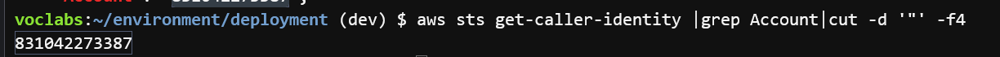

    On line 9, replace <RDS-ENDPOINT> with the actual RDS endpoint.

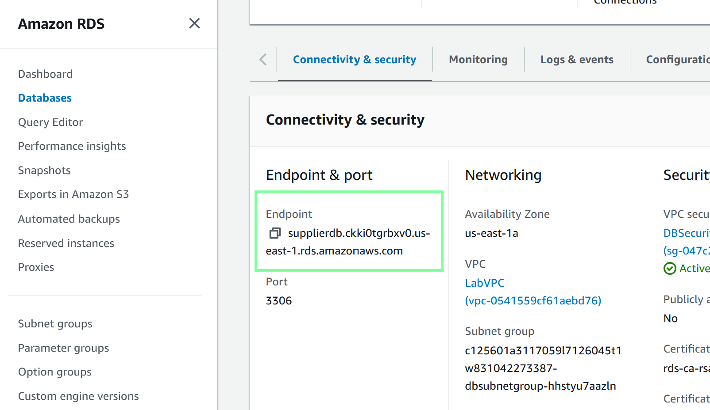
    

Save the changes.

### 3.  To register the customer microservice task definition in Amazon ECS, run the following command:

```
aws ecs register-task-definition --cli-input-json "file:///home/ec2-user/environment/deployment/taskdef-customer.json"
```

### 4.  In the Amazon ECS console, verify that the customer-microservice task definition now appears in the Task definitions pane. Also, notice that the revision number displays after the task definition name.


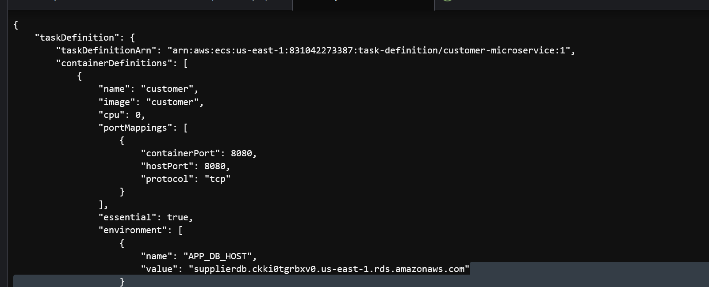

 Tip: Consult the ECS documentation if it is helpful.

### 5.  In the deployment directory, create a taskdef-employee.json specification file. 

    Add the same JSON code to it that currently exists in the taskdef-customer.json file (where you have already set the account ID and RDS endpoints).

    After you paste in the code, change the three occurrences of customer to employee

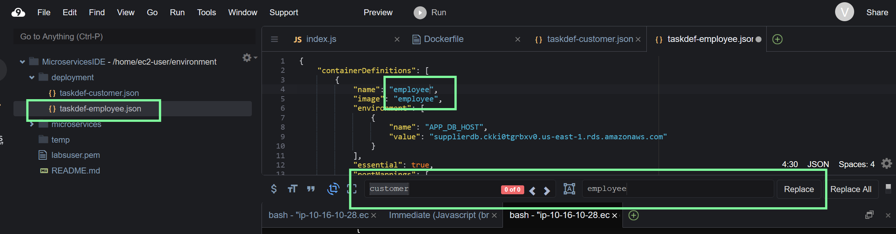

### 6.  To register the employee task definition with Amazon ECS, run an AWS CLI command.

```batch
aws ecs register-task-definition --cli-input-json "file:///home/ec2-user/environment/deployment/taskdef-employee.json"
```

### 7.  In the Amazon ECS console, verify that the employee-microservice task definition now appears in the Task definitions pane. Also, notice that the revision number displays after the task definition name.

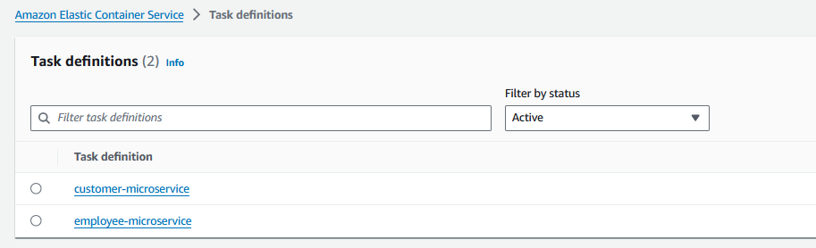


## Task 5.5: Create AppSpec files for CodeDeploy for each microservice

Return to table of contents

In this task, you will continue to complete tasks to support deploying the microservices-based web application to run on an ECS cluster where the deployment is supported by a CI/CD pipeline. In this specific task, you will create two application specification (AppSpec) files, one for each microservice. These files will provide instructions for CodeDeploy to deploy the microservices to the Amazon ECS on Fargate infrastructure.

### 1.  Create an AppSpec file for the customer microservice.

    In the deployment directory, create a new file named appspec-customer.yaml

    Paste the following YAML code into the file:

     Important: DON'T modify <TASK_DEFINITION>. This setting will be updated automatically when the pipeline runs.

```yaml
version: 0.0
Resources:
  - TargetService:
      Type: AWS::ECS::Service
      Properties:
        TaskDefinition: <TASK_DEFINITION>
        LoadBalancerInfo:
          ContainerName: "customer"
          ContainerPort: 8080

```

### 2.  In the same directory, create an AppSpec file for the employee microservice.

    Name the file appspec-employee.yaml.

    The contents of the file should be the same as the appspec-customer.yaml file. However, change customer`` on thecontainerNameline to beemployee`

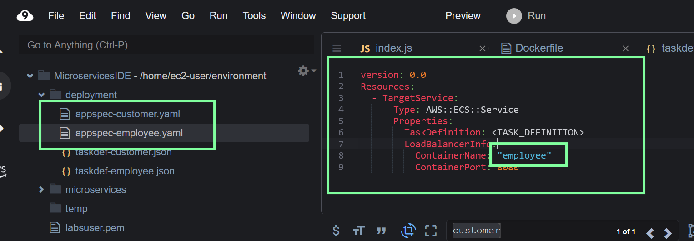


## Task 5.6: Update files and check them into CodeCommit

Return to table of contents

In this task, you will update the two task definition files. Then, you will push the four files that you created in the last two tasks into the deployment repository.

 

### 1.  Edit the taskdef-customer.json file.

Modify line 5 to match the following line:

```
"image": "<IMAGE1_NAME>",
```

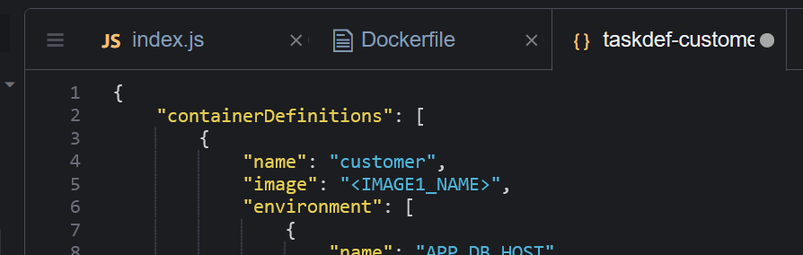

Save the change.

    Analysis: <IMAGE1_NAME> is not a valid image name, which is why you originally set the image name to customer before running the AWS CLI command to register the first revision of the file with Amazon ECS. However, at this point in the project, it's important to set the image value to a placeholder text value. Later in this project, when you configure a pipeline, you will identify IMAGE1_NAME as placeholder text that can be dynamically updated. In summary, CodePipeline will set the correct image name dynamically at runtime.

### 2.  Edit the taskdef-employee.json file.

Modify line 5 to match the following line:

```
"image": "<IMAGE1_NAME>",
```

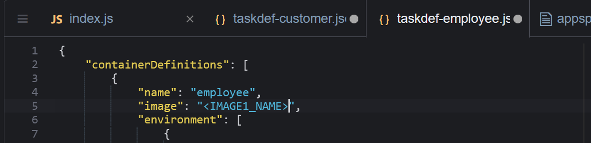

Save the change.

### 3.  Push all four files to CodeCommit.

 Note: Pushing the latest files to CodeCommit is essential. Later, when you create the CI/CD pipeline, the pipeline will pull these files from CodeCommit and use the details in them as instructions to deploy updates for your microservices to the Amazon ECS cluster.


 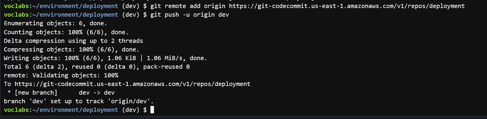

 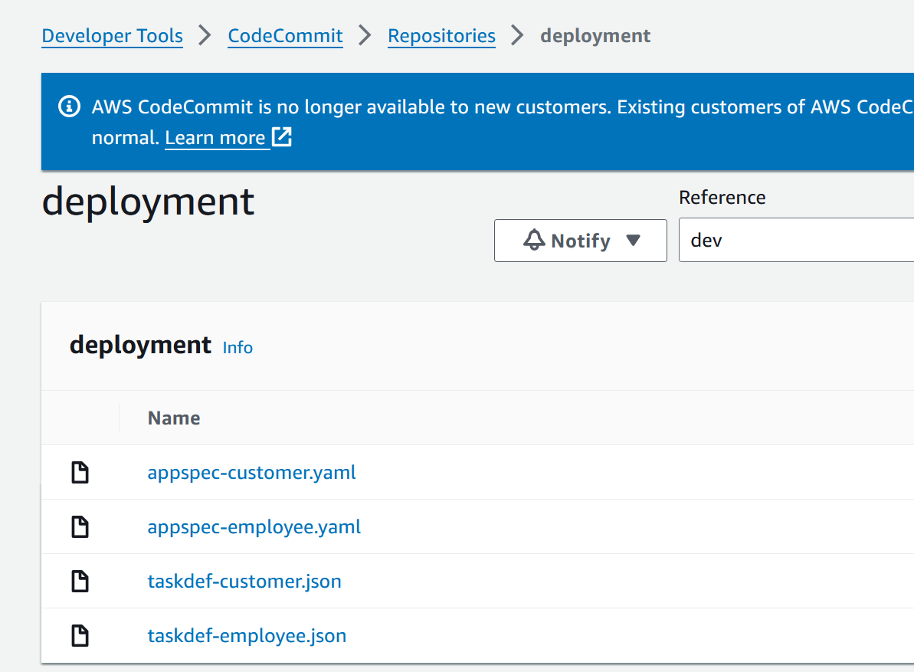