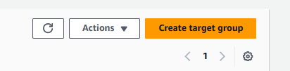
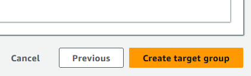
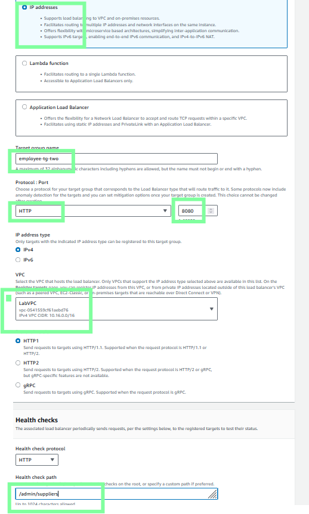
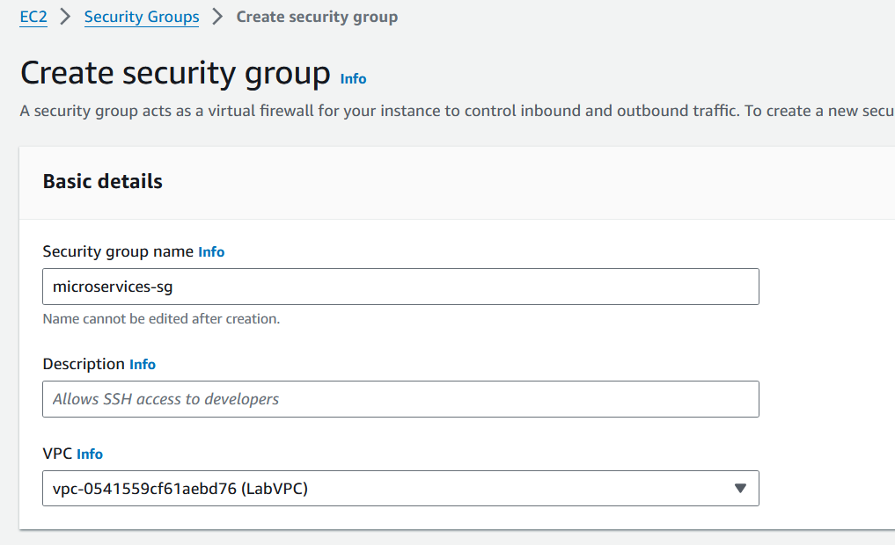

# Phase 6: Creating target groups and an Application Load Balancer

In this phase, you will create an Application Load Balancer, which provides an endpoint URL. This URL will act as the HTTPS entry point for customers and employees to access your application through a web browser. The load balancer will have listeners, which will have routing and access rules that determine which target group of running containers the user request should be directed to.

## Task 6.1: Create four target groups

In this task, you will create four target groups—two for each microservice. Because you will configure a blue/green deployment, CodeDeploy requires two target groups for each deployment group.

 Note: Blue/green is a deployment strategy where you create two separate but identical environments. One environment (blue) runs the current application version, and one environment (green) runs the new application version. For more information, see Blue/Green Deployments in the Overview of Deployment Options on AWS whitepaper.

### 1.  Create the first target group for the customer microservice.

-  Navigate to the Amazon EC2 console.

-  In the navigation pane, choose Target Groups.

-  Choose Create target group and configure the following:

-  Choose a target type: Choose IP addresses.

- Target group name: Enter customer-tg-one

- Protocol: Choose HTTP.

- Port: Enter 8080

- VPC: Choose LabVPC.

- Health check path: Enter /

-  Choose Next.

-  On the Register targets page, accept all defaults (don't register any targets), and choose Create target group.

### 2.  Create a second target group for the customer microservice. Use the same settings as the first target group except use customer-tg-two as the target group name.

### 3.  Create a target group for the employee microservice. Use the same settings as the other target groups with the following exceptions:

-  Target group name: Enter employee-tg-one

-  Health check path: Enter /admin/suppliers

### 4.  Create a second target group for the employee microservice. Use the same settings as the other target groups with the following exceptions:

-  Target group name: Enter employee-tg-two

-  Health check path: Enter /admin/suppliers

-  Important: Carefully confirm the name and port number of each target group. The following image provides an example:

## Task 6.2: Create a security group and an Application Load Balancer, and configure rules to route traffic

Return to table of contents

In this task, you will create an Application Load Balancer. You will also define two listeners for the load balancer: one on port 80 and another on port 8080. For each listener, you will then define path-based routing rules so that traffic is routed to the correct target group depending on the URL that a user attempts to load.

 

### 1.  Create a new EC2 security group named microservices-sg to use in LabVPC. Add inbound rules that allow TCP traffic from any IPv4 address on ports 80 and 8080.

### 2.  In the Amazon EC2 console, create an Application Load Balancer named microservicesLB.

-  Make it internet facing for IPv4 addresses.

-  Use LabVPC, Public Subnet1, Public Subnet2, and the microservices-sg security group.

-  Configure two listeners on it. The first should listen on HTTP:80 and forward traffic to customer-tg-two by default. The second should listen on HTTP:8080 and forward traffic to customer-tg-one by default.

## 3.  Add a second rule for the HTTP:80 listener. Define the following logic for this new rule:

        IF Path is /admin/* 

        THEN Forward to... the employee-tg-two target group.

        The settings should be the same as shown in the following image:

### 4.  Add a second rule for the HTTP:8080 listener. Define the following logic for this new rule:

    IF Path is /admin/* 

    THEN Forward to the employee-tg-one target group.

    The settings should be the same as shown in the following image:

