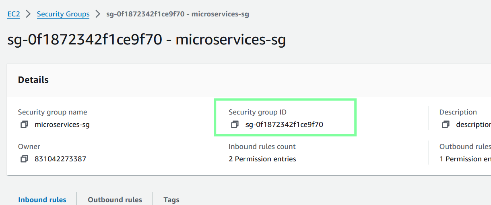
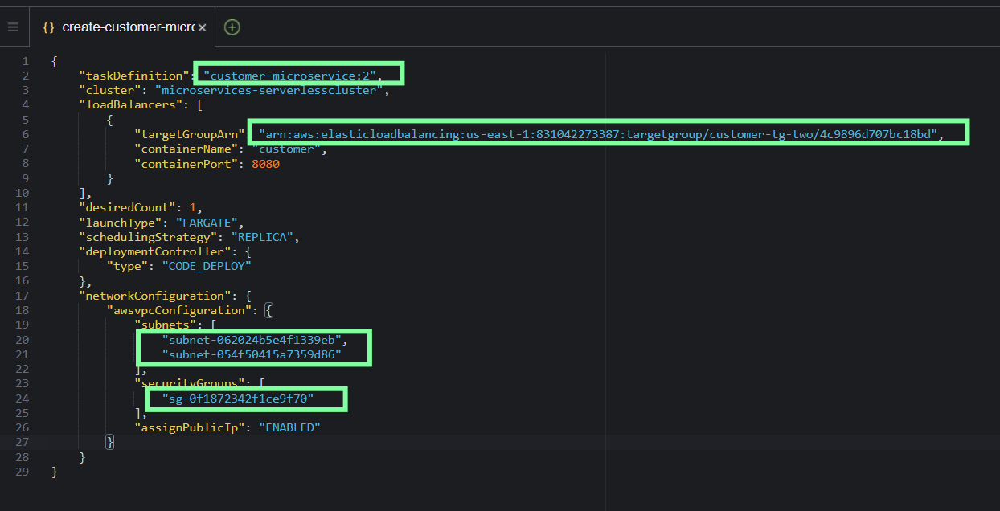

#  Phase 7: Creating two Amazon ECS services

In this phase, you will create a service in Amazon ECS for each microservice. Although you could deploy both microservices to a single ECS service, for this project, it will be easier to manage the microservices independently if each is deployed to its own ECS service.

## Task 7.1: Create the ECS service for the customer microservice

### 1.  In AWS Cloud9, create a new file named create-customer-microservice-tg-two.json in the deployment directory.


### 2.  Paste the following JSON code into the file:

```json
{
    "taskDefinition": "customer-microservice:REVISION-NUMBER",
    "cluster": "microservices-serverlesscluster",
    "loadBalancers": [
        {
            "targetGroupArn": "MICROSERVICE-TG-TWO-ARN",
            "containerName": "customer",
            "containerPort": 8080
        }
    ],
    "desiredCount": 1,
    "launchType": "FARGATE",
    "schedulingStrategy": "REPLICA",
    "deploymentController": {
        "type": "CODE_DEPLOY"
    },
    "networkConfiguration": {
        "awsvpcConfiguration": {
            "subnets": [
                "PUBLIC-SUBNET-1-ID",
                "PUBLIC-SUBNET-2-ID"
            ],
            "securityGroups": [
                "SECURITY-GROUP-ID"
            ],
            "assignPublicIp": "ENABLED"
        }
    }
}

```

### 3.  Edit the create-customer-microservice-tg-two.json file:

-  Replace REVISION-NUMBER with the number of the latest revision of the customer-microservice task definition that is registered with Amazon ECS.

        If this is the first time that you are completing this step, the revision number should be 1.

        If you are repeating this step, find the latest revision number in the Amazon ECS console by choosing Task definitions, and then choosing customer-microservice.


-  Replace MICROSERVICE-TG-TWO-ARN with the actual ARN of the customer-tg-two target group.


-  Replace PUBLIC-SUBNET-1-ID with the actual subnet ID of Public Subnet1.


-  Replace PUBLIC-SUBNET-2-ID with the actual subnet ID of Public Subnet2.


-  Replace SECURITY-GROUP-ID with the actual security group ID of microservices-sg.




-  Save the changes.



### 4.  To create the Amazon ECS service for the customer microservice, run the following commands:

```bash
cd ~/environment/deployment

aws ecs create-service --service-name customer-microservice --cli-input-json file://create-customer-microservice-tg-two.json
```


Troubleshooting tip: If you are repeating this step and previously created the ECS service, you might receive an error about the creation of the service not being idempotent. To resolve this error, force delete the service from the Amazon ECS console, wait for it to drain, and then run the commands again.


## Task 7.2: Create the Amazon ECS service for the employee microservice

Return to table of contents

### 1.  Create an Amazon ECS service for the employee microservice.

-  Copy the JSON file that you created for the customer microservice, and name it create-employee-microservice-tg-two.json. Save it in the same directory.

-  Modify the create-employee-microservice-tg-two.json file:

-  On line 2, change customer-microservice to employee-microservice and also update the revision number.


-  On line 6, enter the ARN of the employee-tg-two target group.

    Tip: Don't just change customer to employee on this line. The ARN is unique in other ways.


-  On line 7, change customer to employee

-  Save the changes.


### 2.  Run the appropriate AWS CLI command to create the service in Amazon ECS.


```
cd ~/environment/deployment

aws ecs create-service --service-name employee-microservice --cli-input-json file://create-employee-microservice-tg-two.json
```

     Note: If you go to the Amazon ECS console and look at the services in the cluster, you might see 0/1 Task running, as shown in the following image. This is expected for now because you haven't launched task sets for these services yet.


