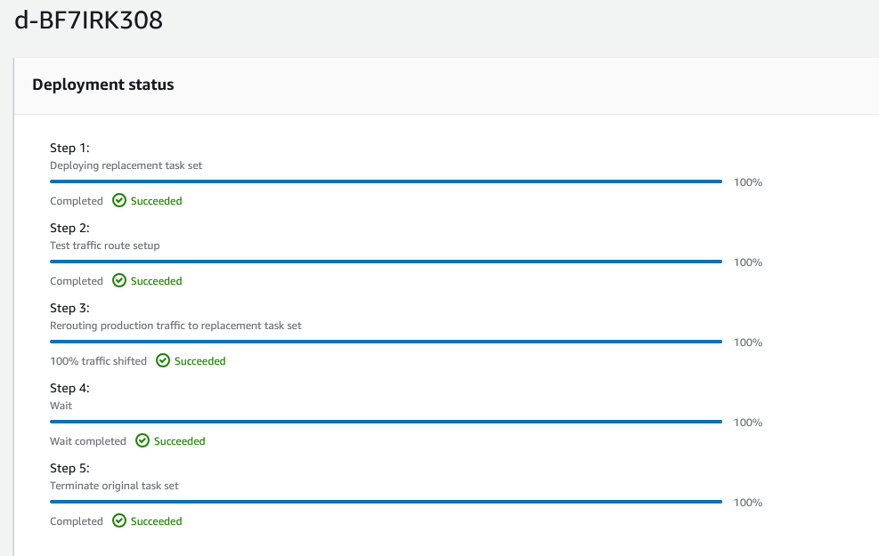

#  Phase 8: Configuring CodeDeploy and CodePipeline

Now that you have defined the Application Load Balancer, target groups, and the Amazon ECS services that comprise the infrastructure that you will deploy your microservices to, the next step is to define the CI/CD pipeline to deploy the application.

The following diagram illustrates the role of the pipeline in the solution that you are building.

Diagram description: The pipeline will be invoked by updates to CodeCommit, where you have stored the ECS task definition files and the CodeDeploy AppSpec files. The pipeline can also be invoked by updates to one of the Docker image files that you have stored in Amazon ECR. When invoked, the pipeline will call the CodeDeploy service to deploy the updates. CodeDeploy will take the necessary actions to deploy the updates to the green environment. Assuming that no errors occur, the new task set will replace the existing task set.

## Task 8.1: Create a CodeDeploy application and deployment groups

A CodeDeploy application is a collection of deployment groups and revisions. A deployment group specifies an Amazon ECS service, load balancer, optional test listener, and two target groups. A group specifies when to reroute traffic to the replacement task set, and when to terminate the original task set and Amazon ECS application after a successful deployment.

 
### 1.      Use the CodeDeploy console to create a CodeDeploy application with the name microservices that uses Amazon ECS as the compute platform.

     Tip: See Create an Application for an Amazon ECS Service Deployment (Console) in the AWS CodeDeploy User Guide.

     Important: DON'T create a deployment group yet. You will do that in the next step.

### 2.  Create a CodeDeploy deployment group for the customer microservice.

-  On the microservices application detail page, choose the Deployment groups tab.
-  Choose Create deployment group and configure the following:

-  Deployment group name: Enter microservices-customer

-  Service role: Place your cursor in the search box, and choose the ARN for DeployRole.

-  In the Environment configuration section:

            ECS cluster name: Choose microservices-serverlesscluster.

            ECS service name: Choose customer-microservice.

-  In the Load balancers section:

            Load balancer: Choose microservicesLB.

            Production listener port: Choose HTTP:80.

            Test listener port: Choose HTTP:8080.

            Target group 1 name: Choose customer-tg-two.

            Target group 2 name: Choose customer-tg-one.

-  In the Deployment settings section:

            Traffic rerouting: Choose Reroute traffic immediately.

            Deployment configuration: Choose CodeDeployDefault.ECSAllAtOnce.

            Original revision termination: Days: 0, Hours: 0, Minutes: 5

        Choose Create deployment group.

### 3.  Create a CodeDeploy deployment group for the employee microservice. Specify the same settings that you did in the prior step, except for the following:

    Deployment group name: Enter microservices-employee

    ECS service name: Choose employee-microservice.

    Target group 1 name: Choose employee-tg-two.

    Target group 2 name: Choose employee-tg-one.

## Task 8.2: Create a pipeline for the customer microservice

Return to table of contents

In this task, you will create a pipeline to update the customer microservice. When you first define the pipeline, you will configure CodeCommit as the source and CodeDeploy as the service that is responsible for deployment. You will then edit the pipeline to add the Amazon ECR service as a second source.

With an Amazon ECS blue/green deployment, which you will specify in this task, you provision a new set of containers, which CodeDeploy installs the latest version of your application on. CodeDeploy then reroutes load balancer traffic from an existing set of containers, which run the previous version of your application, to the new set of containers, which run the latest version. After traffic is rerouted to the new containers, the existing containers can be terminated. With a blue/green deployment, you can test the new application version before sending production traffic to it.

References

    The AWS Academy Cloud Architecting and AWS Academy Cloud Developing courses include hands-on labs that explore CodePipeline features.

    AWS CodePipeline User Guide

 

### 1.  In the CodePipeline console, create a customer pipeline with the following settings:

        Pipeline name: Enter update-customer-microservice

        Service role: Choose the ARN for PipelineRole.

        Source provider: Choose AWS CodeCommit.

        Repository name: Choose deployment.

          Note: You have defined two CodeCommit repositories. The deployment repository contains the Amazon ECS task definition files and CodeDeploy AppSpec files that your pipeline will need, so that is the one you choose here.

            Branch name: Choose dev.

         Note: Skip the build stage.

        Deploy provider:  Amazon ECS (Blue/Green)

            Region: US East (N. Virginia).

            AWS CodeDeploy application name:  microservices

            AWS CodeDeploy deployment group: microservices-customer

            Under Amazon ECS task definition:

                Set a SourceArtifact with a value of taskdef-customer.json

            Under AWS CodeDeploy AppSpec file:

                Set a SourceArtifact with a value of  appspec-customer.yaml

                 Note: Leave the Dynamically update task definition image fields blank for now.

     Note: After you create the pipeline, it will immediately start to run and will eventually fail on the Deploy stage. Ignore that for now and continue to the next step.

### 2.  Edit the update-customer-microservice pipeline to add another source.

    In the Edit: Source section, choose Edit stage, then add an action with these details:

        Action name:  Image

        Action provider:  Amazon ECR

        Repository name:  customer

        Image tag:  latest

        Output artifacts: image-customer

### 3.  Edit the deploy action of the update-customer-microservice pipeline.

        Edit the update-customer-microservice pipeline

            In the Edit: Deploy section, choose Edit stage, then add an input artifact as described below:

                On the Deploy Amazon ECS (Blue/Green) card, choose the edit (pencil) icon.

                Under Input artifacts, choose Add and then choose image-customer.

             Note: You should now have SourceArtifact and image-customer as listed input artifacts.

            Under Dynamically update task definition image, for Input artifact with image details, choose image-customer.

            For Placeholder text in the task definition, enter IMAGE1_NAME

Analysis: Recall that in a previous phase, you entered the IMAGE1_NAME placeholder text in the taskdef-customer.json file before you pushed it to CodeCommit. In this current task, you configured the logic that will replace the placeholder text with the actual image name that the source phase of the CodePipeline returns.

## Task 8.3: Test the CI/CD pipeline for the customer microservice

In this task, you will test that the CI/CD pipeline for the customer microservice functions as intended.

 Important: If you are repeating this task, confirm that all target groups are still associated with the Application Load Balancer. The Reassociate Target Groups with Load Balancer section of the appendix provides more detail.

### 1.  Launch a deployment of the customer microservice on Amazon ECS on Fargate.

        Navigate to the CodePipeline console.

        On the Pipelines page, choose the link for the pipeline that is named update-customer-microservice.

        To force a test of the current pipeline settings, choose Release change, and then choose Release.

         Note: By invoking the pipeline, you created a new revision of the task definition.

        Wait for the two Source tasks to show a status of Succeeded - just now.

        In the Deploy section, wait for a Details link to appear, and then click the link.

        A CodeDeploy page opens in a new browser tab.

### 2. Observe the progress in CodeDeploy.

    Scroll to the bottom of the page, and notice the Deployment lifecycle events section.

     Tip: If you see a "Primary task group must be behind listener" error, refer to the Reassociate Target Groups with Load Balancer section in the appendix.

    Within a few minutes, if everything was configured correctly, all of the deployment lifecycle events should succeed. Don't wait for that to happen—move to the next step. Keep this page open.

### 3.  Load the customer microservice in a browser tab and test it.

    Locate the DNS name value of the microservicesLB load balancer, and paste it into a new browser tab.

    The customer microservice loads. If it doesn't load, add :8080 to the end of the URL and try again.

    Analysis: Recall that your load balancer has two listeners: one on port 80 and another on port 8080. Port 8080 is where the replacement task set will run for the first 5 minutes. Therefore, if you load the :80 URL within the first 5 minutes, the customer microservice page might not load, but you should already see the page at 8080. Then, after 5 minutes, you should see that the microservice is available at both ports.

    In the café web application, choose List of suppliers or Suppliers list.

    The suppliers page loads. It should not have the edit or add supplier buttons because it is a customer page

### 4.  Observe the running tasks in the Amazon ECS console.

    Navigate to the Amazon ECS console.

    In the clusters list, choose the link for microservices-serverlesscluster.

    On the Services tab, notice that the customer-microservice service appears. The Deployments and tasks status will change as the blue/green deployment advances through its lifecycle events.

    Choose the Tasks tab.

    Here you can see the actual tasks that are running. You might have more than one task running per service that you defined.

    Choose the link for one of the listed tasks. You might only have one.

    Here you can see the actual container details and the configuration information, such as the IP addresses that are associated with the running container.

### 5.  Return to the CodeDeploy page that is open in another browser tab.

You should now see that all five steps of the deployment succeeded and the replacement task set is now serving traffic.

### 6.  Observe the load balancer and target group settings.

        In the Amazon EC2 console, choose Target Groups.

        You might notice that the customer-tg-two target group is no longer associated with the load balancer. This is because CodeDeploy is managing the load balancer listener rules and might have determined that some of the target groups are no longer needed.

        Observe the HTTP:80 listener rules.

        The default rule has changed here. The default "if no other rule applies" rule previously pointed to customer-tg-two, but now it points to customer-tg-one. This is because CodeDeploy actively managed your Application Load Balancer.

        Observe the HTTP:8080 listener rules.

        The two rules still forward to the "one" target groups.

Congratulations! You successfully deployed one of the two microservices to Amazon ECS on Fargate by using a CI/CD pipeline.

## Task 8.4: Create a pipeline for the employee microservice

### 1.  In this task, you will create the pipeline for the employee microservice.

Create a pipeline for the employee microservice with the following specifications:

    Pipeline name: update-employee-microservice

    Role ARN: PipelineRole

        Source provider: AWS CodeCommit

            Repository name: deployment

            Branch name: dev

    Deploy provider: Amazon ECS (Blue/Green)

    AWS CodeDeploy application name: microservices

    AWS CodeDeploy deployment group: microservices-employee

    Amazon ECS task definition: SourceArtifact

        Path: taskdef-employee.json

        AWS CodeDeploy AppSpec file: SourceArtifact

        Path: appspec-employee.yaml

### 2.  Add another source to the employee microservice pipeline. Add an action with the following details:

    Action name: Image

    Action provider: Amazon ECR

    Repository name: employee

    Image tag: latest

    Output artifacts: image-employee

### 3.  Edit the Amazon ECS (Blue/Green) action in the deploy stage:

    Add another input artifact and choose image-employee.

    Under Dynamically update task definition image, for Input artifact with image details, choose image-employee.

    For Placeholder text in the task definition, enter IMAGE1_NAME

Save changes:

## Task 8.5: Test the CI/CD pipeline for the employee microservice

In this task, you will test the pipeline that you just defined for the employee microservice.

 Important: If you are repeating this task, confirm that all target groups are still associated with the Application Load Balancer. The Reassociate Target Groups with Load Balancer section of the appendix provides detail if needed.

###  1.  Launch a deployment of the employee microservice on Amazon ECS on Fargate.

    Use the release change feature to force a test of the pipeline.

    Follow the progress in CodeDeploy. Within a few minutes, if everything was configured correctly, all of the Deployment lifecycle events should succeed.

### 2.  Load the employee microservice in a browser tab.

    In the browser tab where the customer microservice is running, choose Administrator link.

    You are directed to a page in the format http://microserviceslb-UNIQUE-NUMBER.us-east-1.elb.amazonaws.com/admin/suppliers.

    The employee microservice loads. If it doesn't load, try adding :8080 just after amazonaws.com in the URL.

    Choose List of suppliers or Suppliers list.

    The suppliers page should load. This version of the page should not have the edit or add supplier buttons. All links in the café web application should now work because you have now deployed both microservices.

### 3.  Observe the running tasks in the Amazon ECS console.

    The Deployments and tasks status will change as the blue/green deployment advances through its lifecycle events.

### 4.  Return to the CodeDeploy page to confirm that all five steps of the deployment succeeded and the replacement task set is now serving traffic.

Congratulations! You successfully deployed the employee microservice to Amazon ECS on Fargate by using a CI/CD pipeline.

## Task 8.6: Observe how CodeDeploy modified the load balancer listener rules

Return to table of contents

    Observe the load balancer and target group settings.

        In the Amazon EC2 console, choose Target Groups.

         Note: If you already had the page open, refresh it.

        Notice that the customer-tg-two target group is no longer associated with the load balancer. This is because CodeDeploy is managing the load balancer listener rules.

         Note: If you are repeating this step, the target groups that are currently attached and unattached might be different.

        Observe the HTTP:80 listener rules.

        The default rule has changed here. For the default "If no other rule applies" rule, the "forward to target group" previously pointed to customer-tg-two, but now it points to customer-tg-one.

        Observe the HTTP:8080 listener rules.

        The two rules still forward to the "one" target groups.

