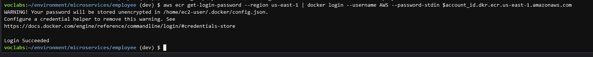

#  Phase 9: Adjusting the microservice code to cause a pipeline to run again

In this phase, you will experience the benefits of the microservices architecture and the CI/CD pipeline that you built. You will begin by adjusting the load balancer listener rules that are related to the employee microservice. You will also update the source code of the employee microservice, generate a new Docker image, and push that image to Amazon ECR, which will cause the pipeline to run and update the production deployment. You will also scale up the number of containers that support the customer microservice.

## Task 9.1: Limit access to the employee microservice

Return to table of contents

In this task, you will limit access to the employee microservice to only people who try to connect to it from a specific IP address. By limiting the source IP to a specific IP address, only users who access the application from that IP can access the pages, and edit or delete supplier entries.

 

### 1.  Confirm that all target groups are still associated with the Application Load Balancer.

    In the Amazon EC2 console, check that all four target groups are still associated with the load balancer. Reassociate target groups as needed before going to the next step.


     Tip: For details, see Reassociating target groups with the load balancer in the appendix.

### 2.  Discover your public IPv4 address. 

 Tip: One resource you can use to do this is https://www.whatismyip.com.

### 3.  Edit the rules for the HTTP:80 listener.

For the rule that currently has "IF Path is /admin/*" in the details, add a second condition to route the user to the target groups only if the source IP of the request is your IP address.


 Tip: For the source IP, paste in your public IPv4 address and then add /32. The following image shows an example:

### 4.  Edit the rules for the HTTP:8080 listener.

Edit the rules in the same way that you edited the rules for the HTTP:80 listener. You want access to the employee target groups to be limited to your IP address.


## Task 9.2: Adjust the UI for the employee microservice and push the updated image to Amazon ECR

In this task, you will adjust the deployed microservices.

 

### 1.  Edit the employee/views/nav.html file.

        On line 1, change navbar-dark bg-dark to navbar-light bg-light

        Save the change.


###  2.  To generate a new Docker image from the employee microservice source files that you modified and to label the image, run the following commands:

```bash
docker rm -f employee_1 
cd ~/environment/microservices/employee
docker build --tag employee .
dbEndpoint=$(cat ~/environment/microservices/employee/app/config/config.js | grep 'APP_DB_HOST' | cut -d '"' -f2)
echo $dbEndpoint
account_id=$(aws sts get-caller-identity |grep Account|cut -d '"' -f4)
echo $account_id
docker tag employee:latest $account_id.dkr.ecr.us-east-1.amazonaws.com/employee:latest
```


###  3.  Push an updated image to Amazon ECR so that the update-employee-microservice pipeline will be invoked.

    In the CodePipeline console, navigate to the details page for the update-employee-microservice pipeline. Keep this page open.


    To push the new employee microservice Docker image to Amazon ECR, run the following commands in your AWS Cloud9 IDE:

```bash
#refresh credentials in case needed
aws ecr get-login-password --region us-east-1 | docker login --username AWS --password-stdin $account_id.dkr.ecr.us-east-1.amazonaws.com
#push the image
docker push $account_id.dkr.ecr.us-east-1.amazonaws.com/employee:latest
```




At least one layer should indicate that it was pushed, which indicates that the image was modified since it was last pushed to Amazon ECR. You could also look in the Amazon ECR repository to confirm the last modified timestamp of the image that is tagged as the latest.


## Task 9.3: Confirm that the employee pipeline ran and the microservice was updated

Return to table of contents

 

### 1.  Observe the update-employee-microservice pipeline details in the CodePipeline console.

    Notice that when you uploaded a new Docker image to Amazon ECR, the pipeline was invoked and ran. Note that the pipeline might take a minute or two to notice that the Docker image was updated before the pipeline is invoked.


### 2.  Observe the details in the CodeDeploy console.


## Task 9.4: Test access to the employee microservice

In this task, you will test access to the employee microservice.

### 1.  Test access to the employee microservice pages at http://<alb-endpoint>/admin/suppliers and http://<alb-endpoint>:8080/admin/suppliers from the same device that you have used for this project so far. Replace <alb-endpoint> with the DNS name of the microservicesLB load balancer.

    At least one of the two pages should load successfully.

    Notice that the banner with the page title is a light color now because of the change that you made to the nav.html file. Pages that are hosted by the customer microservice still have the dark banner. This demonstrates that by using a microservices architecture, you could independently modify the UI or features of each microservice without affecting others.


###  2.  Test access to the same employee microservice pages from a different device.

For example, you could use your phone to connect from the cellular network and not the same Wi-Fi network that your computer uses. You want the device to use a different IP address to connect to the internet than your computer.

You should get a 404 error on any page that loads, and the page should say "Coffee suppliers" instead of "Manage coffee suppliers." This is evidence that you cannot successfully connect to the employee microservice from another IP address.

 Tip: If you don't have another network available, run the following command in the AWS Cloud9 terminal: curl http://<alb-endpoint>/admin/suppliers. The source IP address of the AWS Cloud9 instance is different than your browser's source IP. The result should include <p class="lead">Sorry, we don't seem to have that page in stock</p>.


This proves that the updated rules on the load balancer listener are working as intended.

 Tip: If the update doesn't function as intended, you could go to the Deployments page in the CodeDeploy console within 5 minutes to stop the deployment and roll back to the previous version. You would choose Stop and roll back deployment and then choose Stop and rollback. This action would reroute production traffic to the original task set and then delete the replacement task set. You configured the 5-minute setting in phase 8, task 1.


## Task 9.5: Scale the customer microservice

In this task, you will scale up the number of containers that run to support the customer microservice. You can make this change without causing the update-customer-microservice pipeline to run.

 
### 1.   Update the customer service in Amazon ECS.

    Run the following command:

```bash
aws ecs update-service --cluster microservices-serverlesscluster-c --service customer-microservice --desired-count 3
```
    A large JSON-formatted response is returned.  

   

### 2.  Go to the Amazon ECS services view.

It might look similar to the following image.


  

Note: The employee-microservice might show 2/1 tasks running. This could happen because a replacement task set (which has one container) has been created, but the original task set remains active for the first 5 minutes in case you decide to roll back.